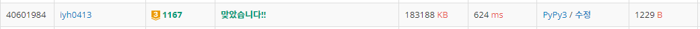
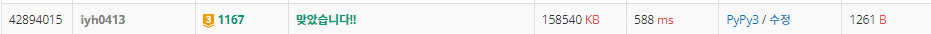

# [Baekjoon] 1167. 트리의 지름 [G3]

## 📚 문제 : [트리의 지름](https://www.acmicpc.net/problem/1167)

---

## 📖 풀이

전에 풀었던 1967. 트리의 지름 문제와 거의 유사하다.

차이점은 입력으로 들어오는 것이 부모와 자식 관계가 아닌 정점 두 사이의 연결이다.

양방향으로 다 입력이 들어오니 입력을 다 받아준 후 visited로 확인하여 한쪽 방향으로만 진행할 수 있도록 해준다.

재귀함수를 돌면서 입력받은 정점의 visited 인덱스를 1로 바꾼다.

그리고 자식 노드를 검사할 때 visited이 0인 자식노드가 없으면 리프 노드인 것이다.

이 과정만 전 문제에서 추가하면 된다.

나머지 풀이는 다음을 참고한다.

### 📌 [1967. 트리의 지름 블로그 포스팅 참고](https://velog.io/@yunhlim/Baekjoon-1967.-%ED%8A%B8%EB%A6%AC%EC%9D%98-%EC%A7%80%EB%A6%84-G4)

## 📒 코드

```python
def recur(n):
    global total_max
    visited[n] = 1          # 정점 방문 표시
    
    result = []
    for c, w in arr[n]:     # 자식 노드를 재귀호출하면서 가중치 값을 더해준다.
        if not visited[c]:  # 방문했던 노드는 부모 노드로 사용했으니 보지 않는다.
            result.append(w + recur(c))

    if result == []:        # 자식 노드가 없으면 0을 반환
        return 0

    result.sort()           # 노드에 연결된 길이들을 크기 순대로 정렬한다.
    result = result[::-1][0:2]      # 가장 긴 2개만 남긴다.
    total_max = max(total_max, sum(result))  # 2개를 합한 것이 현재 구한 최대 트리의 지름보다 큰지 확인

    return result[0]        # 노드에 연결된 선 중 가장 긴 길이를 리턴


n = int(input())
arr = [[] for _ in range(n + 1)]    # 부모 노드를 인덱스로 하는 리스트(자식노드와 가중치를 담는다.)
visited = [0 for _ in range(n + 1)]
temp = [list(map(int, input().split())) for _ in range(n)]
for i in range(n):
    s = 0
    while temp[i][s] > 0:   # -1이면 종료
        if s == 0:          # 첫 번째 입력을 정점 v1
            v1 = temp[i][s]
            s += 1
        else:
            arr[v1].append([temp[i][s], temp[i][s + 1]])    # 두 번째 입력부터 정점 v2, w로 받아 arr에 넣어준다.
            s += 2
total_max = 0   # 가장 긴 트리의 지름

recur(1)
print(total_max)
```

## 🔍 결과



---

## 📖 트리의 지름 유형 정석 풀이

트리의 지름을 구하는 정석적인 풀이법은 다음과 같다.

>1. 임의의 노드에서 가장 먼 노드를 찾는다.
>
>2. 그 노드에서 가장 먼 노드까지의 거리가 트리의 지름이다.

임의의 노드를 노드 1로 잡고, 노드에서 가장 거리가 먼 노드를 찾는다.

위에서 구한 노드에서 가장 먼 거리의 노드까지의 거리를 출력하면 된다.

dfs로 노드에서 가장 먼 노드까지의 거리를 찾는다.

가장 먼 거리를 변수로 두고, dfs로 탐색하며 거리와 비교하며 업데이트한다.

더 먼 거리가 나와 업데이트 할 때마다, 그 때의 노드도 기억해야 한다.

## 📒 코드

```python
def longest(node):  # 입력된 노드를 기준으로 가장 먼 거리와 그 때의 노드를 출력
    global visited, max_dist, find_node
    visited = [0 for _ in range(n + 1)]
    max_dist = 0
    find_node = 0
    dfs(node, 0)
    return max_dist, find_node


def dfs(x, dist):
    global find_node, max_dist    # 함수 바깥에서의 변수를 바인딩
    visited[x] = 1
    if max_dist < dist:             # 거리가 멀면
        max_dist = dist             # 최대 거리로 업데이트하고
        find_node = x               # 그 때의 노드도 업데이트
    for c, w in graph[x]:
        if visited[c]:              # 방문한 값인지 확인
            continue
        dfs(c, dist + w)


n = int(input())
graph = [[] for _ in range(n + 1)]
for i in range(n):
    temp = list(map(int, input().split()))
    s = temp[0]
    for i in range(1, len(temp) - 1, 2):
        graph[s].append([temp[i], temp[i + 1]])

visited = [0 for _ in range(n + 1)]
max_dist, find_node = 0, 0
d, node = longest(1)        # 1에서 가장 먼 노드를 찾는다.
d, node = longest(node)     # 위에서 찾은 노드 기준 가장 먼 노드까지의 거리를 찾는다.
print(d)                    # 위에서 구한 가장 먼 거리를 출력
```

## 🔍 결과

