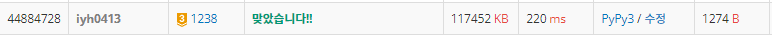

# [Baekjoon] 1238. 파티 [G3]

## 📚 문제 : [파티](https://www.acmicpc.net/problem/1238)

## 📖 풀이

다익스트라 알고리즘을 가는 방향, 오는 방향으로 2번 사용한다.

1. 모든 정점 => X까지의 최단경로

2. X => 모든 정점까지의 최단경로

1번의 결과를 담은 리스트와 2번의 결과를 담은 리스트를 더해 가장 값이 큰 수를 출력한다.

다익스트라 알고리즘을 사용하는 형식은 정해져있다.

**heap**을 활용해 해결한다.

우선 모든 정점까지 거리를 INF로 큰 값으로 초기화한다.

- 시작점은 거리를 0으로 놓고 heap에 담으며 시작한다.

heap을 사용하기 위해 graph 연결 상태를 담을 때 [시간, 연결된 노드]로 담아준다.

- 시간을 먼저 적는 이유는 heap으로 최소값을 뽑을 때 시간이 작은 값을 뽑아야 하기 때문이다.

heap에 똑같은 노드가 또 들어있는 경우가 있는데, 이 때는 d값이 heap에 있는 값과 다르니 이 때 continue를 걸어줘서 해결하면 된다.

## 📒 코드

```python
import heapq


def dijkstra(dir):      # dir이 0이면 x에서 각 정점까지 최단경로, dir이 1이면 각 정점에서 x까지 최단경로
    heap = [[0, x]]
    while heap:
        t, v = heapq.heappop(heap)
        if d[dir][v] != t:      # 이미 갱신된 값인 경우는 보지않는다.
            continue
        for t_nxt, nxt in graph[dir][v]:
            if d[dir][nxt] > t + t_nxt:   # 거쳐가는 경우의 시간이 더 작아질 때 바꾼다.
                d[dir][nxt] = t + t_nxt
                heapq.heappush(heap, [d[dir][nxt], nxt])


n, m, x = map(int, input().split())
graph = [[[] for _ in range(n + 1)] for _ in range(2)]  # x => 각 정점 최단경로, 각 정점 => x 최단경로
for _ in range(m):      
    s, e, t = map(int, input().split())
    graph[0][s].append([t, e])     # 시간을 앞에 적는다(heap으로 사용하기 위해)
    graph[1][e].append([t, s])     # 모든 정점에서 x까지 역방향으로 되돌아가는 걸 구하기 위해

INF = 10000000
d = [[INF for _ in range(n + 1)] for _ in range(2)]     # 2가지 다 구한다.

d[0][x], d[1][x] = 0, 0     # 시작점의 거리는 0
dijkstra(0)
dijkstra(1)

max_ans = 0
for i in range(1, n + 1):   # 두 결과를 더해 최댓값을 출력한다.
    max_ans = max(max_ans, d[0][i] + d[1][i])

print(max_ans)
```

## 🔍 결과

