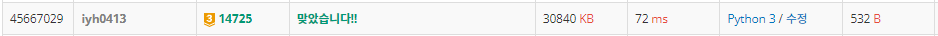

# [Baekjoon] 14725. 개미굴 [G3]

## 📚 문제 : [개미굴](https://www.acmicpc.net/problem/14725)

## 📖 풀이

사전 순서가 앞서는 먹이 정보가 먼저 나온다.

주어진 먹이 정보를 보고 시각화해서 출력하는 문제이다.

**트라이**라는 자료구조가 사용된다고 한다.

트라이는 모르고 개인적으로 드는 아이디어로 해결해보았다.~~(뭔가 트라이랑 비슷한 거 같기는 하다.)~~

딕셔너리에 key에는 이전 값들을 value에는 추가된 값들을 적어준다.

예제 입력으로 설명을 하면

- Input

```
4
2 KIWI BANANA
2 KIWI APPLE
2 APPLE APPLE
3 APPLE BANANA KIWI
```

입력의 한 줄씩 확인한다.

첫번째 줄을 보면 처음에 KIWI가 나온다. 그러면 KIWI를 'root'라는 key에 담아준다.

root에서 연결된 노드라는 뜻이다.

그리고 BANANA는 ('root', 'KIWI')라는 key에 value로 담아준다.

value에는 set() 자료형으로 담아 중복을 제거하고, 다 담아준 후 list로 변경하고 정렬해준다.

다 담으면 다음과 같이 딕셔너리에 담긴다.

```
{('root',): ['APPLE', 'KIWI'], ('root', 'KIWI'): ['APPLE', 'BANANA'], 
('root', 'APPLE'): ['APPLE', 'BANANA'], ('root', 'APPLE', 'BANANA'): ['KIWI']}
```

root도 튜플에 더하기 편하게 ('root',)로 처음에 시작해주었다.

DFS를 통해 오름차순으로 정렬된 순서대로 출력하면 된다.

이 때 depth는 key의 길이로 판단하면 된다. depth에 맞춰 '--'를 곱해 더해준다.

## 📒 코드

```python
import sys
input = sys.stdin.readline


def recur(cur):
    if not tree.get(cur):
        return

    for food in tree[cur]:
        print((len(cur) - 1) * '--' + food)
        recur(cur + (food,))


n = int(input())
tree = {}

for _ in range(n):
    temp = list(input().split())
    prv = ('root',)   # key가 0인 경우
    for food in temp[1:]:
        cur = food
        tree[prv] = tree.get(prv, set())
        tree[prv].add(cur)
        prv = prv + (cur,)

for c in tree:
    tree[c] = sorted(list(tree[c]))

recur(('root',))
```

## 🔍 결과

