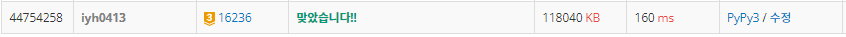

# [Baekjoon] 16236. 아기 상어 [G3]

## 📚 문제 : [아기 상어](https://www.acmicpc.net/problem/16236)

## 📖 풀이

구현 문제이다.

### 문제를 요약

- 물고기 M마리와 아기 상어 1마리가 있다. 1초에 상하좌우로 인접한 한 칸씩 이동한다.

- 자신의 크기보다 큰 물고기가 있는 칸은 지날 수 없고, 나머지 칸은 모두 지날 수 있다.

  - 자신의 크기보다 작은 물고기만 먹을 수 있다.

  - 크기가 같은 물고기는 먹을 수 없지만, 지날 수는 있다.

- 가장 가까운 물고기를 먹으러 간다. 
  - 거리가 가까운 물고기가 많다면 가장 위에 있는 물고기, 그리고 가장 왼쪽에 있는 물고기를 먹는다.

자신의 크기와 같은 수의 물고기를 먹을 때마다 크기가 1 증가한다. 처음 아기 상어의 크기는 2이다.

더 이상 움직일 수 없으면 종료한다.


### 풀이 방법

상어의 위치와 크기를 기억한다.

BFS로 탐색한다. (가장 가까운 물고기를 먹으러 가기 위해)

우하좌상 네 방향 탐색

같은 거리에 먹을 수 있는 물고기들을 배열에 담는다.

물고기들을 가장 위쪽, 왼쪽 순으로 오름차순 정렬하여 물고기를 선택하여 먹는다.

먹을 수 없는 경우 종료한다.


## 📒 코드

```python
from collections import deque


def shark(x, y, move):            # 아기 상어가 다음 먹이를 찾아 이동한다.
    global eat, size
    que = deque()
    que.append([x, y])
    visited = [[0] * n for _ in range(n)]       # 방문했는지 확인
    visited[x][y] = 1
    dist = 0            # 다음 먹이까지의 거리
    fishes = []         # 같은 거리인 경우 먹을 수 있는 물고기의 좌표들
    while que:
        dist += 1
        for _ in range(len(que)):
            x, y = que.popleft()     # 상어의 위치
            for i in range(4):       # 네 방향으로 탐색
                nx = x + dx[i]
                ny = y + dy[i]
                if not (0 <= nx < n and 0 <= ny < n):   # 범위 안에 있는지 확인
                    continue
                if visited[nx][ny]:               # 확인했던 위치일 때
                    continue
                if 0 < arr[nx][ny] < size:      # 작은 물고기가 있을 때
                    fishes.append([nx, ny])
                elif arr[nx][ny] == 0 or arr[nx][ny] == size:       # 크기가 같은 물고기가 있거나, 물고기가 없을 때
                    que.append([nx, ny])
                    visited[nx][ny] = 1
        if fishes:
            fishes.sort()               # 물고기들 중 (맨 위 => 맨 왼쪽)에 있는 물고기 선택
            fish = fishes[0]
            eat += 1                    # 먹은 횟수 + 1
            if eat == size:             # 물고기를 먹은 개수가 크기랑 같아지면 진화
                size += 1
                eat = 0
            arr[fish[0]][fish[1]] = 0             # 먹은 물고기를 제거
            return shark(fish[0], fish[1], move + dist)
    return move


n = int(input())
arr = [list(map(int, input().split())) for _ in range(n)]
size = 2        # 아기 상어 초기 사이즈 : 2
eat = 0         # 먹은 물고기 숫자 
dx, dy = [0, 1, 0, -1], [1, 0, -1, 0]       # 네 방향
for i in range(n):
    for j in range(n):
        if arr[i][j] == 9:
            arr[i][j] = 0
            print(shark(i, j, 0))
```

## 🔍 결과

