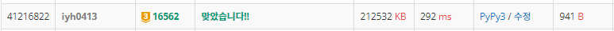

# [Baekjoon] 16562. 친구비 [G3]

## 📚 문제

https://www.acmicpc.net/problem/16562

---

## 📖 풀이

**연결리스트** 문제이다. 연결된 것들 중 가장 작은 값을 리턴해 더해준다.

가장 작은 값들을 다 더하는데 가지고 있는 돈보다 많으면 oh no를 출력한다.

DFS를 stack으로 많이 사용해서 해결했는데 재귀함수로 풀어본다.

재귀 깊이제한이 걸려 깊이 제한의 범위를 더 넓혀 해결한다.

## 📒 코드

```python
import sys
sys.setrecursionlimit(10000)
input = sys.stdin.readline


def dfs(cur):       # DFS 재귀 함수
    visited[cur] = 1
    fee = arr[cur]      # 요금의 최소 값
    for nxt in v[cur]:
        if visited[nxt]:
            continue
        fee = min(fee, dfs(nxt))
    return fee          # 최소 요금 리턴


n, m, k = map(int, input().split())
arr = [0] + list(map(int, input().split()))
v = [[] * (n + 1) for _ in range(n + 1)]    # 인접리스트에 관계를 담는다.
for _ in range(m):                      # 그래프에 값을 넣어준다.
    a, b = map(int, input().split())
    v[a].append(b)                      # 서로 친구니까 방향없는 그래프
    v[b].append(a)
visited = [0 for _ in range(n + 1)]     # 방문 표시

total = 0
for i in range(1, n + 1):
    if visited[i] == 0:
        total += dfs(i)
        if total > k:
            print("Oh no")
            break
else:
    print(total)
```

## 🔍 결과

