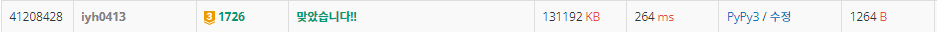

# [Baekjoon] 1726. 로봇 [G3]

## 📚 문제

https://www.acmicpc.net/problem/1726

---

## 📖 풀이

최소를 구하는 것이므로, **BFS 탐색**을 활용한다.

네 방향의 델타 탐색에다가 방향 회전까지 더해진다.

방향을 함께 담기 위해 visited를 3차원으로 선언해 각 좌표의 방향마다 따로 처리해준다.

최소값을 계속 갱신해줘야 하니 나올 수 없는 최댓값으로 초기화한다.

방향을 90도 방향으로 할 수 있고, 전진은 1 ~ 3칸까지 가능하므로 5번의 경우를 확인한다. 방향은 우 하 좌 상으로 각각 1, 2, 3, 4로 입력이 들어온다. 따라서 0부터 시작하지 않으므로 padding을 visited를 선언할 때 넣어줘야 한다.

좌표는 padding을 넣기 귀찮으므로 넣지 않고 시작점과 도착점의 좌표값을 각각 1씩 뺀다.

방향이 우, 하인 경우는 좌, 상으로 회전시켜주면 된다. 그 때 더 최소값으로 visited를 바꿀 수 있으면 바꾸고 큐에 담는다.

전진은 1 ~ 3칸 할 수 있는데 입력받은 배열에 1이 있는지 확인한다. 1이 있으면 갈 수 없으므로 break로 다음 칸도 확인하지 않고 종료한다. 갈 수 있다면, 이동한 후 visited를 확인해 최소값인 경우 바꾸고 큐에 담아준다.

위 과정을 반복하며 원하는 도착점에 원하는 방향으로 도착했을 때 출력하고 종료한다.

## 📒 코드

```python
from collections import deque


m, n = map(int, input().split())
arr = [list(map(int, input().split())) for _ in range(m)]
s_x, s_y, s_d = list(map(int, input().split()))     # 시작점 좌표와 방향
e_x, e_y, e_d = list(map(int, input().split()))     # 도착점 좌표와 방향
s_x -= 1        # 주어진 입력 좌표가 1,1부터 시작하는데 패딩을 넣기 귀찮으니 입력에서 각각 1을 빼준다.
s_y -= 1
e_x -= 1
e_y -= 1
INF = 100000
dx = [0, 0, 0, 1, -1]  # padding + 우 좌 하 상
dy = [0, 1, -1, 0, 0]
visited = [[[0, INF, INF, INF, INF] for _ in range(n)] for _ in range(m)]   # 네 방향 값으로 초기화 해준다.
visited[s_x][s_y][s_d] = 0      # 시작점은 명령이 0이니 넣어준다.

queue = deque()
queue.append((s_x, s_y, s_d))   # 시작점을 큐에 넣고 시작
while queue:
    x, y, d = queue.popleft()
    if [x, y, d] == [e_x, e_y, e_d]:        # 도착점의 원하는 방향에 도달했을 때
        print(visited[e_x][e_y][e_d])       # 명령받은 값을 출력하고 종료
        break
    for i in range(1, 5):   # 방향 전환
        if d in [1, 2] and i in [1, 2]:     # d가 우, 좌 방향인데 회전할 방향도 우, 좌이면 안 된다.
            continue
        if d in [3, 4] and i in [3, 4]:     # d가 하, 상 방향인데 회전할 방향도 하, 상이면 안 된다.
            continue
        if visited[x][y][i] > visited[x][y][d] + 1:     # 회전했을 때 저장된 값보다 작으면 바꿔주고 큐에 담는다.
            visited[x][y][i] = visited[x][y][d] + 1
            queue.append((x, y, i))

    for i in range(1, 4):   # 전진, 1~3으로 움직일 수 있다.
        nx = x + dx[d] * i
        ny = y + dy[d] * i
        if not (0 <= nx < m and 0 <= ny < n) or arr[nx][ny] == 1:   # 중간에 갈 수 없으면 종료
            break
        if visited[nx][ny][d] > visited[x][y][d] + 1:   # 전진했을 때 저장 값보다 작으면 바꿔주고 큐에 담는다.
            visited[nx][ny][d] = visited[x][y][d] + 1
            queue.append((nx, ny, d))
```

## 🔍 결과

