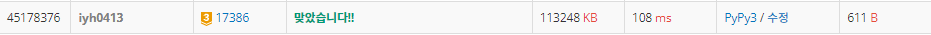

# [Baekjoon] 17386. 선분 교차 1 [G3]

## 📚 문제 : [선분 교차 1](https://www.acmicpc.net/problem/17386)

## 📖 풀이

두 선분이 주어질 때 교차하는지 체크하는 문제이다.

**CCW**로 해결한다.

세 점이 일직선 위에 있는 경우가 없으니 두 선분 사이에서 CCW의 곱을 구해 둘 다 0보다 작을 때만 1을 출력하면 된다.

두 선분이 교차하는지 판단하기 위해 CCW로 연관관계를 파악한다.

한 선분의 두 점이 p1, p2이고, 다른 선분의 두 점이 p3, p4라고 하면,

p1, p2를 이루는 선분에서 점 p3와의 CCW를 구하고 p4와의 CCW를 구해 곱이 0보다 작게 되면 교차하는 것이다.

직선이면 위 하나만 구해도 되지만 두 선분의 교차를 구하려면 p3, p4를 이루는 선분에서도 p1, p2 각각의 점에 대한 CCW를 구한 후 곱해 0보다 작은지 확인해야 한다.

> ccw(p1, p2, p3) * ccw(p1, p2, p4) <= 0 and ccw(p3, p4, p1) * ccw(p3, p4, p2) <= 0

위 조건을 만족할 때 교차한다.

한 직선 위에 놓이지 않으니 한 직선 위에 놓일 때의 예외 상황은 확인하지 않아도 된다.

## 📒 코드

```python
def ccw(p1, p2, p3):
    return p1[0] * p2[1] + p2[0] * p3[1] + p3[0] * p1[1] - \
        (p1[1] * p2[0] + p2[1] * p3[0] + p3[1] * p1[0])


x1, y1, x2, y2 = map(int, input().split())
x3, y3, x4, y4 = map(int, input().split())
p1, p2 = [x1, y1], [x2, y2]
p3, p4 = [x3, y3], [x4, y4]

p12 = ccw(p1, p2, p3) * ccw(p1, p2, p4)  # p1, p2 선분으로 p3과 p4에 대한 ccw의 곱
p34 = ccw(p3, p4, p1) * ccw(p3, p4, p2)  # p3, p4 선분으로 p1과 p2에 대한 ccw의 곱
if p12 <= 0 and p34 <= 0:   # 두 선분이 교차하는 경우
    print(1)
    exit()
print(0)        # 나머지는 교차하지 않는다.
```

## 🔍 결과

