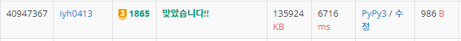

# [Baekjoon] 1865. 웜홀 [G3]

## 📚 문제

https://www.acmicpc.net/problem/1865

---

## 📖 풀이 - 플로이드 와샬

테스트케이스가 5개까지 들어올 수 있어 시간이 아슬아슬하다..

도로와 가중치가 존재한다. 웜홀은 시간이 거꾸로 가니 음수이다.

가중치가 음수이고 시작위치가 모든 정점이면서, 정점의 개수가 적으니 **플로이드 와샬 알고리즘**을 쓴다!!

0보다 작은 값을 찾으면 되는거지 되돌아 왔을 때 최단 경로를 구하라는 문제가 아니므로 그 자리로 가는 경로를 0으로 굳이 만들지 않는다.

플로이드 와샬 알고리즘을 쓴 후, 하나라도 0보다 작은 값이 나오면 YES를 출력하고 종료한다.

## 📒 코드

```python
import sys
input = sys.stdin.readline

def floyd():
    for k in range(1, n + 1):       # 거쳐갈 경유지
        for i in range(1, n + 1):   # 출발지
            if k == i:              # 경유지와 출발지는 달라야 한다
                continue
            for j in range(1, n + 1):   # 목적지
                if k == j:          # 경유지와 목적지도 달라야 한다
                    continue
                arr[i][j] = min(arr[i][j], arr[i][k] + arr[k][j])   # 경유하는 거리가 짧으면 바꿔준다.
                if arr[i][i] < 0:           # 하나라도 0보다 작으면 YES를 출력
                    return 'YES'                
    return 'NO'

for tc in range(int(input().rstrip())):
    n, m, w = map(int, input().split())     # n : 지점의 수 m : 도로의 수 w : 웜홀의 수
    INF = n * 10000
    arr = [[INF] * (n + 1) for _ in range(n + 1)]
    for i in range(m):  # 도로는 방향이 없는 그래프
        s, e, t = map(int, input().split())
        arr[s][e] = min(t, arr[s][e])       # 가장 작은 값을 넣어준다.
        arr[e][s] = min(t, arr[e][s])       # 가장 작은 값을 넣어준다.
    for i in range(w):  # 웜홀은 방향 있는 그래프
        s, e, t = map(int, input().split())
        arr[s][e] = min(-t, arr[s][e])      # 음수도 가장 작은 값을 넣어준다.
    
    print(floyd())
```

## 🔍 결과



플로이드 와샬 알고리즘으로 풀리긴하는데 시간이 오래걸린다.

---

## 📖 풀이 - 벨만 포드(정석적인 풀이)

굳이 다 찾을 필요 없이 음수가 나왔을 때 종료시키면 되니 플로이드 와샬 알고리즘보다 벨만 포드 알고리즘을 사용하는 것이 시간 관리 상 유리하다.

**벨만포드 알고리즘**이 무엇인지 알아보자!

다익스트라는 가장 작은 거리의 정점을 확인하면서 힙을 이용해 시간을 줄여 구현했다면, 벨만 포드는 거리가 음수가 있으니 현재 정점에서 연결된 모든 정점들을 확인하면서 구현한다.

정점의 개수보다 1 적은 횟수로 돌면 음의 cycle이 없을 때 현재 위치 기준 최단 경로를 다 찾을 수 있다. 그리고 음의 cycle이 있는지는 정점의 개수만큼 돌면 알 수 있는데 이 때에도 값들이 갱신이 되면 음의 사이클이 있는 것이다. 음의 사이클이 있으면 몇 번을 돌아도 계속 갱신된다.

워홀 문제는 음의 사이클이 존재하는지 찾는 문제이다. 따라서 **음의 cycle**이 있는지 찾는 건 하나의 정점만 시행해도 찾을 수 있다. 이 이유때문에 벨만포드가 플로이드 와샬보다 훨씬 단축시킬 수 있다.

정점의 개수만큼 돌고 그 떄에도 값이 바뀌는지 확인한다!

## 📒 코드

```python
# 벨만 포드 알고리즘
import sys
input = sys.stdin.readline


def bellman():      # 벨만포드 알고리즘, 음의 사이클이 있는지 확인
    for i in range(n):
        for j in range(1, n + 1):
            for node in graph[j]:
                if dist[node] > dist[j] + arr[j][node]:
                    dist[node] = dist[j] + arr[j][node]
                    if i == n - 1:      # n - 1번 이후인 n번에도 바뀌면 음의 사이클 존재
                        return 'YES'
    return 'NO'


for tc in range(int(input().rstrip())):
    n, m, w = map(int, input().split())     # n : 지점의 수 m : 도로의 수 w : 웜홀의 수
    INF = n * 10000
    arr = [[INF] * (n + 1) for _ in range(n + 1)]   # 거리를 담아준다.
    graph = [set() for _ in range(n + 1)]              # 관계를 담아준다.
    for i in range(m):  # 도로는 방향이 없는 그래프
        s, e, t = map(int, input().split())
        arr[s][e] = min(t, arr[s][e])       # 가장 작은 값을 넣어준다.
        arr[e][s] = min(t, arr[e][s])       # 가장 작은 값을 넣어준다.
        graph[s].add(e)
        graph[e].add(s)
    for i in range(w):  # 웜홀은 방향 있는 그래프
        s, e, t = map(int, input().split())
        arr[s][e] = min(-t, arr[s][e])      # 음수도 가장 작은 값을 넣어준다.
        graph[s].add(e)
    dist = [INF for _ in range(n + 1)]

    print(bellman())
```

## 🔍 결과


시간이 훨씬 단축되었다.😉
