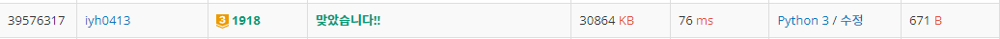

# [Baekjoon] 1918. 후위 표기식 [G3]

## 📚 문제

https://www.acmicpc.net/problem/1918

---

SWEA에서 풀었던 계산기 문제이다. 복습하는 겸 풀어본다.

연산자를 stack에 담고 우선순위는 `*/, +-, ( ` 순이다. 

우선순위가 자기보다 크거나 같은 연산자가 있으면 stack에서 다 pop한 후 stack에 push 한다. 

예를 들어 *이 나오면 stack 상단에 *이나 /가 있으면 pop하고 자기보다 우선순위가 낮은 +, -, ( 를 만나면 stack에 push한다. )가 나오면 (를 만날 때까지 stack에서 pop한다. 

(는 꺼내면 없앤다. 연산자는 꺼내면 후위 표기식을 작성한 리스트에 넣어준다. 연산자가 아닌 다른 문자나 숫자가 나오면 후위 표기식에 넣는다.

문자열을 다 처리했으면 stack에 있는 걸 순차적으로 후위 표기식에 담아주고 끝낸다.

## 📒 코드

```python
arr = list(input())
stack = []  # 연산자를 담을 stack
temp = []  # 후위 표기식으로 나타낸 걸 담을 리스트
for v in arr:  # 후위 표기식을 나타내기
    if v in '*/':
        while stack and stack[-1] in '*/':
            temp.append(stack.pop())
        stack.append(v)
    elif v in '+-':
        while stack and stack[-1] in '+-*/':
            temp.append(stack.pop())
        stack.append(v)
    elif v == '(':
        stack.append(v)
    elif v == ')':
        while stack[-1] != '(':
            temp.append(stack.pop())
        stack.pop()
    else:
        temp.append(v)
while stack:
    temp.append(stack.pop())
print(''.join(temp))
```

## 🔍 결과



SWEA에서 했던 문제라 쉽다.