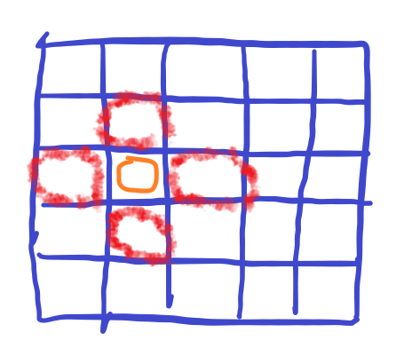
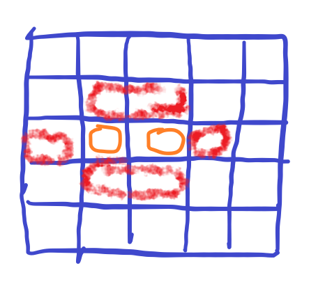
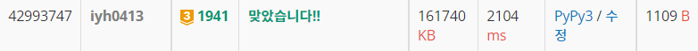
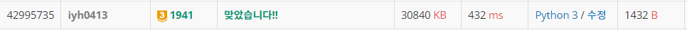

# [Baekjoon] 1941. 소문난 칠공주 [G3]

## 📚 문제 : [소문난 칠공주](https://www.acmicpc.net/problem/1941)

---

## 📖 풀이

5 x 5 중 7개로 연결할 수 있는 모든 경우를 파악해야 한다.

우선 모든 점을 시작점으로 잡고 매 순간마다 2차원 배열을 탐색하며 현재 고른 점들의 인접한 점을 선택해 확장해나갔다.

배열을 2차원으로 보지 않고 칠공주파를 1차원에 좌표 값을 튜플 값으로 담으며 확인해나간다.

그림으로 보면 다음과 같다.

1. 먼저 시작점을 잡는다. (모든 좌표의 점을 시작점으로 잡아줘 다 확인한다.)

   

2. 현재 놓여진 칠공주파의 주변으로 확장해나간다. 그럼 갈 수 있는 곳이 다음과 같다.

   

3. 네 군데를 다 확인해야 하는데 일단 임의로 한 방향으로 움직인다.

   오른쪽 방향으로 이동하면 다음 움직일 수 있는 곳은 아래와 같다.

   

따라서 한 명씩 놓아줄 때마다 칠공주파들을 순회하며 다음 움직일 수 있는 곳으로 움직여준다.

7명이 될 때 값이 그러면 중복된 값이 나올 수 있는데, 나는 set() 자료형으로 값을 담으며 중복을 제거해주었다.

set에 리스트를 담을 수 없으니 배열을 정렬 시킨 후 tuple로 형변환한다.

`[(1, 1), (2, 1), (4, 3)]` 이면 `((1, 1), (2, 1), (4, 3))` 으로 바꾸어 세트 자료형에 담아준다.

좌표는 정렬시키니 똑같은 값이 나올 때 중복을 제거할 수 있다.

중간에 가지치기를 위해 앞으로 추가할 수 있는 횟수를 전부 S로 뽑아도 S가 4보다 작으면 더 이상 답이 될 수 없으니 종료한다.


## 📒 코드

```python
def in_range(x, y):     # 배열이 5x5를 넘어가는지 파악
    return 0 <= x < 5 and 0 <= y < 5


def recur(cur, cnt):    # 7명을 만들어 준다.
    if 7 - cur + cnt < 4:       # 남은 횟수를 모두 S로 뽑아도 답이 될 수 없는 경우
        return

    if cur == 7:        # 칠공주 완성
        result_visited.add(tuple(sorted(visited)))
        return

    for x, y in visited:          # 현재 칠공주파에 속한 좌표를 찾아준다.
        for k in range(4):      # 네 방향으로 델타 탐색
            nx = x + dx[k]
            ny = y + dy[k]
            if not in_range(nx, ny) or (nx, ny) in visited:
                continue
            visited.append((nx, ny))     # 방문표시
            # S인 경우는 cnt + 1, Y면 cnt
            recur(cur + 1, cnt + 1 if arr[nx][ny] == 'S' else cnt)
            visited.pop()     # 재귀가 끝나면 방문표시 제거


arr = list(input() for _ in range(5))
dx = [0, 1, 0, -1]
dy = [1, 0, -1, 0]
result_visited = set()
for i in range(5):
    for j in range(5):
        visited = [(i, j)]      # 시작점을 잡아준다.
        recur(1, 1 if arr[i][j] == 'S' else 0)  # 시작점이 S인지 Y인지 파악

print(len(result_visited))      # 될 수 있는 조합의 개수를 센다.
```

## 🔍 결과



시간이 오래걸렸다. 좀 더 시간을 줄여보자.

---

## 📖 개선된 풀이

가지치기를 더 한다.

시작점을 S가 아닌 사람은 고르지 않고, S인 사람만 고른다. 그리고 다른 S로 시작할 때 이미 확인했던 S가 나오면 pass하도록 한다. 왜냐면 S를 포함한 모든 경우를 다 찾았기 때문에 또 찾는 과정을 줄인다.

## 📒 개선된 코드

```python
def in_range(x, y):     # 배열이 5x5를 넘어가는지 파악
    return 0 <= x < 5 and 0 <= y < 5


def recur(cur, cnt):    # 7명을 만들어 준다.
    if 7 - cur + cnt < 4:       # 남은 횟수를 모두 S로 뽑아도 답이 될 수 없는 경우
        return

    if cur == 7:        # 칠공주 완성
        result.add(tuple(sorted(visited)))
        return

    for x, y in visited:            # 현재 칠공주파에 속한 좌표를 찾아준다.
        for k in range(4):          # 네 방향으로 델타 탐색
            nx = x + dx[k]
            ny = y + dy[k]
            if not in_range(nx, ny) or (nx, ny) in visited:
                continue
            # 이미 확인한 S일 때
            if arr[nx][ny] == 'S' and (nx < i or (nx == i and ny < j)):  
                continue
            visited.append((nx, ny))     # 방문표시
            # S인 경우는 cnt + 1, Y면 cnt
            recur(cur + 1, cnt + 1 if arr[nx][ny] == 'S' else cnt)
            visited.pop()     # 재귀가 끝나면 방문표시 제거


arr = list(input() for _ in range(5))
dx = [0, 1, 0, -1]
dy = [1, 0, -1, 0]
result = set()
for i in range(5):
    for j in range(5):
        if arr[i][j] != 'S':
            continue
        visited = [(i, j)]      # 시작점을 잡아준다.
        recur(1, 1)  # 시작점이 S인지 Y인지 파악

print(len(result))      # 될 수 있는 조합의 개수를 센다.
```

## 🔍 개선된 결과

