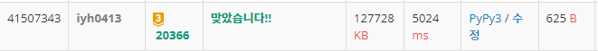

# [Baekjoon] 20366. 같이 눈사람 만들래? [G3]

## 📚 문제

https://www.acmicpc.net/problem/20366

---

## 📖 풀이

n이 600이므로 조합으로 4가지 경우를 다 고르면 시간초과가 발생한다. 600 x 599 x 598 x 597 = 1000억을 넘는다.

조합으로 2개를 고른다. 그리고 나머지 2개는 **투 포인터**로 차이의 최솟값을 찾는다.

이 때 조합으로 고른 2개의 수를 만나면 건너뛴다.

## 📒 코드

```python
def two_pointer(i, j):      # 투포인터로 차이의 최소값을 찾아준다.
    sum1 = arr[i] + arr[j]  # 조합으로 고른 i, j의 합을 구한다.
    s, e = 0, n - 1
    min_abs = 10000000000
    while s < e:
        if s in [i, j]:     # s, e가 i, j이면 건너뛴다.
            s += 1
            continue
        elif e in [i, j]:
            e -= 1
            continue
        min_abs = min(min_abs, abs(sum1 - (arr[e] + arr[s])))   # 최솟값 비교
        if arr[e] + arr[s] >= sum1:     # 크면 e를 움직인다.
            e -= 1
        else:                           # 작으면 s를 움직인다.
            s += 1
    return min_abs

n = int(input())
arr = sorted(list(map(int, input().split())))

min_result = 10000000000
for i in range(n):
    for j in range(i + 1, n):       # 조합으로 2개를 고른다.
        min_result = min(min_result, two_pointer(i, j))

print(min_result)
```

## 🔍 결과

