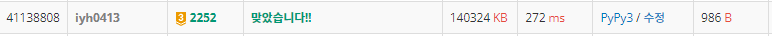

# [Baekjoon] 2252. 줄 세우기 [G3]

## 📚 문제

https://www.acmicpc.net/problem/2252

---

## 📖 풀이

우선 순위에 따라 등장해야하니 **위상 정렬** 문제이다.

정점에서 연결되는 그래프를 2차원 배열에 인접 리스트로 표시한다.

이 때 위상을 표시해준다. 위상이란 값이 등장하기 위해 몇 개가 우선적으로 등장해야 하는지 표시하는 것이다.

그리고 큐를 활용해 위상이 0인 값들을 담아준다.

0인 값은 최우선적으로 등장하는데 순서가 상관없으니 1부터 검색하며 큐에 넣어준다. 큐에서 값을 꺼내면 등장했는지 확인한다.

꺼낸 정점에서 연결된 정점들을 그래프를 통해 순회하며, 연결된 정점들의 위상을 하나씩 줄인다. 그리고 위상이 0인 값들을 큐에 넣어준다.

같은 입력이 들어오는 경우가 존재할 수 있으니(문제에서 언급이 따로 없다.) 입력을 받을 때 중복된 값인지 확인해야 한다.

## 📒 코드

```python
from collections import deque
import sys
input = sys.stdin.readline

n, m = map(int, input().split())
in_degree = [0 for _ in range(n + 1)]
arr = [set() for _ in range(n + 1)]
visited = [0 for _ in range(n + 1)]
for _ in range(m):
    s, e = map(int, input().split())
    if e not in arr[s]:     # 같은 입력이 들어올 수 있으니 처리
        in_degree[e] += 1   # 연결된 정점들의 위상을 +1
        arr[s].add(e)

queue = deque()
for i in range(1, n + 1):   # 위상이 0인 값들을 큐에 담는다.
    if in_degree[i] == 0:
        queue.append(i)

result = []
while queue:                # 큐에는 위상이 0인 값들만 들어온다.
    v = queue.popleft()
    result.append(v)        # 결과 리스트에 순차적으로 넣어준다.
    for v2 in arr[v]:       # 연결된 정점들을 순회
        in_degree[v2] -= 1  # 위상을 -1
        if in_degree[v2] == 0:  # 위상이 0이면 큐에 담는다.
            queue.append(v2)
print(*result)
```

## 🔍 결과

