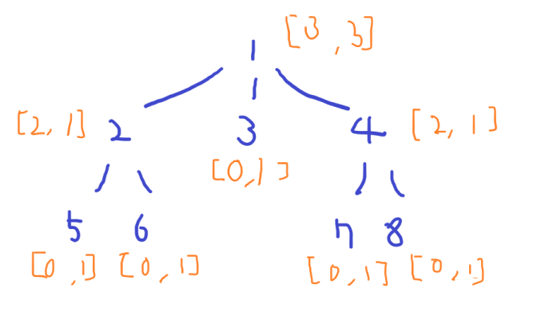

# [Baekjoon] 2533. 사회망 서비스(SNS) [G3]

## 📚 문제 : [사회망 서비스(SNS)](https://www.acmicpc.net/problem/2533)

## 📖 풀이

### 문제 해석

사회망 관계가 트리로 연결되어있다.

- 사이클 X
- 모든 정점들이 연결

연결된 모든 친구가 얼리어답터인 경우 아이디어를 받아들인다.

얼리어답터가 아닌 친구들이 모두 얼리어답터에 연결되게 하는 최소한의 얼리어답터 수를 구하는 문제이다.

---

root를 하나 정한다. 간단히 1를 root로 한다.

탑다운 DP로 풀어본다.

DP로 해결한다. dp를 0, 1로 쪼개나가면서 풀 수 있다.

현재 노드가 얼리어답터인 경우와 아닌 경우 2가지로 해결한다.

예제를 탑다운으로 해결하는 모습을 그림으로 그려본다.

dp : [노드가 얼리어답터가 아닌 경우, 노드가 얼리어답터인 경우]



0인 경우는 현재 얼리어답터가 없어 이룰 수 없는 경우이다.

자식이 없는 노드들은 무조건 [0, 1]이다.

- 현재 노드가 얼리어답터가 아니면 이룰 수 없으니 0이다.
- 현재 노드가 얼리어답터이면 하나이므로 1이다.

n번째 노드에서의 점화식은 다음과 같다.

- 현재 노드가 얼리어답터가 아닌 경우
  - 자식 노드가 모두 얼리어답터여야 한다.
  - n의 자식들을 childs라고 하면
  - `dp[n][0] += dp[child][1]`
- 현재 노드가 얼리어답터인 경우
  - 자식 노드가 얼리어답터이든 아니든 상관없다.
  - 따라서 작은 값을 더해준다.
  - `dp[n][1] += min(dp[child])`

탑다운 방식으로 dp를 처리하고 최종적으로 dp[1]의 최솟값을 출력한다.

## 📒 코드

```python
import sys
input = sys.stdin.readline
sys.setrecursionlimit(10000000)  # 주어진 입력이 1000000이다. 그것보다 크게 범위를 늘린다.


def recur(node):
    visited[node] = 1
    if dp[node][1]:             # dp에 값이 저장되어 있는 경우
        return dp[node]
    dp[node][1] = 1    # 현재 노드가 얼리어답터이니 1로 시작
    for v in graph[node]:  # 현재 노드에 연결된 노드 순회
        if visited[v]:  # 이미 나왔던 노드는 자식 노드가 아닌, 부모 노드
            continue
        non_early, early = recur(v)     # 자식 노드가 얼리 어답터인 경우와 아닌 경우
        dp[node][0] += early        # 현재 노드가 얼리 어답터가 아니면, 자식은 모두 얼리 어답터여아 한다.
        dp[node][1] += min(early, non_early)    # 현재 노드가 얼리 어답터이면, 자식 노드는 얼리 어답터이든 아니든 상관없다.
                                                # 따라서 작은 값으로 사용한다.
    return dp[node]
    

n = int(input())
graph = [[] for _ in range(n + 1)]      # 노드들의 연결 관계
dp = [[0, 0] for _ in range(n + 1)]     # 노드에서 최소 얼리 어답터 수(현재 노드가 얼리 어댑터가 아닌 경우와, 얼리 어댑터인 경우)
visited = [0 for _ in range(n + 1)]     # 이미 확인한 노드인지 확인하기 위한 배열
for i in range(n - 1):      # 연결 관계를 graph에 담아준다.
    a, b = map(int, input().split())
    graph[a].append(b)
    graph[b].append(a)
 
print(min(recur(1)))        # 1를 루트 노드로 시작
```

## 🔍 결과

