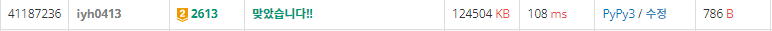

# [Baekjoon] 2613. 숫자 구슬 [G2]

## 📚 문제

최댓값이 최소가 되는 문제!! - > 이진탐색으로 해결한다.

x x x x x x o o o o o o o o o..

최댓값이 최소이므로 위처럼 나온다.

따라서 이진탐색을 하는 경우, 매개변수 탐색을 활용해 만족하는 가장 왼쪽 값을 찾는다.

이제 최댓값이 x일 때 가능한지 안한지 찾는 함수를 작성해야 한다.

나는 재귀함수를 사용했다.

왼쪽부터 최댓값 이하로 꽉 채울 수 있는 숫자 구슬을 그룹에 채워나간다.

이 때 중요한 건 그룹마다 숫자구슬이 하나 있어야 하니, 채울 때 남은 그룹 수만큼 구슬을 남기면서 그룹에 채워야 한다.

누적합을 활용해 구슬이 최댓값보다 작은지 파악했다.

마지막 구슬들을 더하면서 원하는 최댓값보다 크면 종료한다.

## 📒 코드

```python
def check(cur, prv):
    global mid
    if cur == m - 1:
        if arr[-1] - arr[prv] <= mid:
            visited.append(n - prv)
            return True
        return False
    nxt = -1
    for i in range(prv + 1, n - m + cur + 2):
        if arr[i] - arr[prv] > mid:
            break
        nxt = i

    if nxt != -1:
        visited.append(nxt - prv)
        return check(cur + 1, nxt)

    return False


n, m = map(int, input().split())
arr = [0] + list(map(int, input().split()))

s, e = max(arr), sum(arr)
for i in range(1, n + 1):   # 누적합
    arr[i] += arr[i - 1]

ans = 0
while s <= e:
    visited = []
    mid = (s + e) // 2
    if check(0, 0):
        e = mid - 1
        ans = mid
        result = visited[:]
    else:
        s = mid + 1
print(ans)
print(*result)
```

## 🔍 결과

