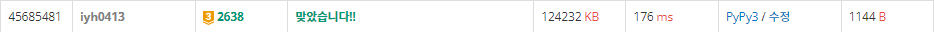

# [Baekjoon] 2638. 치즈 [G3]

## 📚 문제 : [치즈](https://www.acmicpc.net/problem/2638)

## 📖 풀이

치즈는 외부 공기에 2면 이상 접촉한 경우만 녹는다.

빈 공간이 아닌 외부 공기를 배열에 담아 확인하며 치즈를 녹여나가야 한다.

(0, 0)과 연결된 모든 연결요소를 처음에 외부 공기로 설정할 수 있다. 따라서 **DFS** 탐색을 통해 외부 공기 연결요소를 다 air라는 2차원 리스트에 1로 표시한다.

그리고 매일 치즈들이 외부 공기에 2면 이상 닿아있는지 확인하고 그 치즈들은 remove 배열에 담아준다.

remove 배열에 담긴 건 치즈를 제거하며, 제거한 치즈가 있는 공간은 외부 공기가 차지하니 주변으로 다시 DFS로 외부 공기인지 확인해준다. 왜냐하면 내부 공기가 치즈가 녹으면서 연결 될 수 있으니 치즈를 제거할 때마다 확인해주어야 한다.

## 📒 코드

```python
def in_range(x, y):     # 범위 안에 있는지 확인
    return 0 <= x < n and 0 <= y < m

def check():        # 외부 공기와 맞닿은 부분이 2개 이상인 치즈 제거
    remove = []
    for x in range(n):
        for y in range(m):
            if arr[x][y]:
                cnt = 0
                for i in range(4):
                    nx = x + dx[i]
                    ny = y + dy[i]
                    if air[nx][ny]:     # 외부 공기와 맞닿은지 확인
                        cnt += 1
                if cnt >= 2:            # 2면 이상 맞닿은 경우
                    remove.append([x, y])
    return remove


def add_air(x, y):  # 외부 공기의 연결요소들을 이어준다. DFS로 확인
    air[x][y] = True
    
    for i in range(4):      # 네 방향으로 확장
        nx = x + dx[i]
        ny = y + dy[i]
        # 공기가 아니면 확장 X
        if not in_range(nx, ny) or air[nx][ny] or arr[nx][ny]:
            continue
        add_air(nx, ny)
    

def cheese():
    add_air(0, 0)       # 처음 외부 공기들을 연결
    day = 0
    while True:
        remove = check()
        if not remove:          # 더 이상 제거할 치즈가 없으면 종료
            return day
        for x, y in remove:
            arr[x][y] = 0       # 치즈 제거
            add_air(x, y)       # 외부 공기 유입
        day += 1


n, m = map(int, input().split())
arr = [list(map(int, input().split())) for _ in range(n)]
air = [[0] * m for _ in range(n)]       # 외부 공기는 1, 아니면 0
dx, dy = [0, 1, 0, -1], [1, 0, -1, 0]
print(cheese())
```

## 🔍 결과

