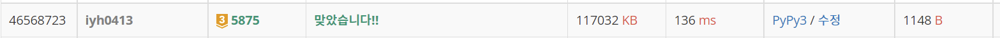

# [Baekjoon] 5875. 오타 [G3]

## 📚 문제 : [오타](https://www.acmicpc.net/problem/5875)

## 📖 풀이

하나를 고침으로써 올바른 괄호쌍이 될 수 있는 경우의 수를 출력하는 문제이다.

n이 **100000**이다. 따라서 하나씩 괄호를 바꿔주고 계산하려하면 O(n^2)이니 불가능하다.

**누적합**으로 계산해본다.

여는 괄호는 +1, 닫는 괄호는 -1로 바꿔준다.

누적합의 끝 값을 확인해 바꿔줘야 할 괄호를 알 수 있다.(여는 괄호가 많은 지, 닫는 괄호가 많은 지 알 수 있다.)

끝 값이 +2 이면 여는 괄호가 하나 더 많은 것이고, -2이면 닫는 괄호가 하나 더 많은 것이다.

끝 값이 0이면 안 고쳐도 가능하니 0을 출력한다.

여는 괄호가 많은 경우와 닫는 괄호가 많은 경우를 나눠서 생각한다.

중요한 포인트는 누적합에 음수를 없애고 끝 값을 0으로 만드는 것이다.

### 여는 괄호가 많은 경우

예를 들어 입력이 `()(((())`로 주어졌다고 하자.

여는 괄호가 하나 더 많다.

괄호를 +1, -1로 바꾸면 `1 0 1 2 3 4 3 2`이다.

여는 괄호가 많은 경우는 닫는 괄호를 추가하는 것이니 +1 => -1로 바꾸는 것이다.

따라서 뒤부터 확인하며 누적합이 1이 나오면 종료한다. 1인 경우를 바꿔버리면 누적합에 음수가 생기니 괄호쌍이 맞지 않는다.

누적합이 1이 아직 나오지 않았으면서, 확인하는 인덱스의 괄호가 여는 괄호면 경우의 수에 1을 더해준다. 그리고 종료되면 총 경우의 수의 개수를 출력한다.

### 닫는 괄호가 많은 경우

예제의 입력으로 확인한다. `()(())))`

닫는 괄호가 하나 더 많다.

닫는 괄호가 많은 경우는 앞에서부터 확인하며 누적합이 -1이 나오면 그 값까지만 바꾸고 종료한다. 왜냐하면 그 이후의 값을 바꿔도 이전에 음수 값이 존재하기 때문이다.

누적합이 -1이 나올 때까지 닫는 괄호의 개수를 세준다. 그리고 종료되면 개수를 출력한다.

## 📒 코드

```python
arr = [0] + [1 if x == '(' else -1 for x in input()]      # 괄호가 '('이면 1, ')'이면 -1
prefix_sum = [0 for _ in range(len(arr))]       # 괄호의 누적합

for i in range(1, len(arr)):                    # 괄호의 누적합을 구한다.
    prefix_sum[i] = arr[i] + prefix_sum[i - 1]

cnt = 0
if prefix_sum[-1] == 2:      # 여는 괄호가 더 많을 때
    for i in range(1, len(arr))[::-1]:
        if prefix_sum[i] == 1:  # 현재 인덱스의 누적합이 1이면 종료
            break               # 바꾸면 음수가 되므로 불가능
        if arr[i] == 1:     # 여는 괄호를 닫는 괄호로 바꿀 수 있다.
            cnt += 1
elif prefix_sum[-1] == -2:                       # 닫는 괄호가 더 많을 때
    for i in range(1, len(arr)):    # 음수가 나오면 그 수까지 확인하고 종료
        if arr[i] == -1:
            cnt += 1
        if prefix_sum[i] < 0:   # 현재 인덱스의 누적합이 음수가 처음 나왔다면 이 괄호까지만 변경 가능
            break               # 다음 인덱스부터 바꾸면 음수가 있는 인덱스가 존재해버린다.
print(cnt)
```

## 🔍 결과



