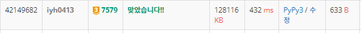

# [Baekjoon] 7579. 앱 [G3]

## 📚 문제

https://www.acmicpc.net/problem/7579

---

## 📖 풀이

**DP** 배낭 문제를 생각해보면 된다.

일단 행은 앱들을 하나씩 넣는다. 열을 메모리로 할지 비용으로 할지 정해야한다.

일반적으로 메모리로 해야 테이블의 끝 값으로 값을 구할 수 있어서 좋다. 그렇지만 메모리의 값이 너무 커서 시간초과가 발생한다.

따라서 비용이 열, 메모리가 값이다.

비용을 열로 생각했을 때 문제점은 dp 테이블의 맨 끝 값이 답이 아니다.

dp의 마지막 줄을 다 채우고 m보다 크거나 같을 때의 비용을 찾던지, 아니면 dp의 끝 줄을 앞이나 뒤부터 확인한 후 m을 기준으로 바뀌는 순간을 찾는다.

나는 dp의 마지막 행의 끝부터 채워나가며 m보다 작아지는 순간 그 때보다 하나 큰 값을 출력했다. 

예제를 한 번 풀어본다.

각 앱의 메모리와 비용은 다음과 같다.

>1번 앱 : 30 3
>
>2번 앱 : 10 0
>
>3번 앱 : 20 3
>
>4번 앱 : 35 5
>
>5번 앱 : 40 4

|      | 0    | 1    | 2    | 3    | 4    | 5    | 6    | 7    | 8    | 9    | 10   | 11   | 12   | 13   | 14   | 15   |
| ---- | ---- | ---- | ---- | ---- | ---- | ---- | ---- | ---- | ---- | ---- | ---- | ---- | ---- | ---- | ---- | ---- |
| 1    | 0    | 0    | 0    | 30   | 30   | 30   | 30   | 30   | 30   | 30   | 30   | 30   | 30   | 30   | 30   | 30   |
| 2    | 10   | 10   | 10   | 40   | 40   | 40   | 40   | 40   | 40   | 40   | 40   | 40   | 40   | 40   | 40   | 40   |
| 3    | 10   | 10   | 10   | 40   | 40   | 40   | 60   | 60   | 60   | 60   | 60   | 60   | 60   | 60   | 60   | 60   |
| 4    | 10   | 10   | 10   | 40   | 40   | 45   | 60   | 60   | 75   | 75   | 75   | 95   | 95   | 95   | 95   | 95   |
| 5    | 10   | 10   | 10   | 40   | 50   | 50   | 60   | 80   | 80   | 85   | 100  | 100  | 115  | 115  | 115  | 135  |


## 📒 코드

```python
def recur(cur, y):
    if y < 0:       # 비용이 0보다 작은 값은 memory를 더해도 0보다 작게 아주 작은 값을 리턴
        return -10000000
    if cur < 0:     # 아무것도 없을 땐, 0에서 출발
        return 0

    if dp[cur][y] != -1:    # dp가 채워진 경우
        return dp[cur][y]
    
    memory = memories[cur]
    fee = fees[cur]
    ret = max(recur(cur - 1, y), recur(cur - 1, y - fee) + memory)

    dp[cur][y] = ret
    return ret


n, m = map(int, input().split())
memories = list(map(int, input().split()))
fees = list(map(int, input().split()))
total_fees = sum(fees)      # 나올 수 있는 최대 비용
dp = [[-1] * (total_fees + 1) for _ in range(n)]    # 개수 x 비용인 dp 테이블

for i in range(total_fees + 1)[::-1]:   # dp 테이블의 맨 뒤부터 채운다.
    if dp[n-1][i] == -1:    # dp가 어느정도 채워지는지 확인할 수 없으니 채워졌는지 확인하고 재귀를 돌린다.
        recur(n - 1, i)
    if dp[n-1][i] < m:      # m보다 작은 값이 처음 나오는 순간을 찾는다.
        print(i + 1)        # 작은 값이 아니던 가장 작은 값 출력
        break
```

## 🔍 결과


