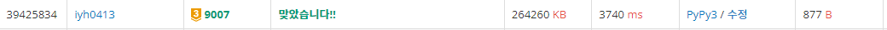

# [Baekjoon] 9007. 카누 선수 [G3]

## 📚 문제

https://www.acmicpc.net/problem/9007

---

n 이 1000이니 for문 2개까지 써도 된다!

배열을 2개씩 묶어버린다.

1, 2반의 몸무게를 각 한 명씩 더한 배열을 만들고 3, 4반의 몸무게를 각 한 명씩 더한 배열을 만든다.

위에서 만든 두 배열을 정렬 시킨다.

그리고 두 배열을 투포인터를 활용해 해결한다.

## 📒 코드

```python
T = int(input())
for _ in range(T):
    k, n = map(int, input().split()) # k는 보트가 원하는 무게, n은 각 반당 인원
    arr = [list(map(int, input().split())) for _ in range(4)] # 4 반의 학생들의 몸무게
    arr_1 = []
    arr_2 = []

    for i in range(n):
        for j in range(n):
            arr_1.append(arr[0][i] + arr[1][j])
            arr_2.append(arr[2][i] + arr[3][j])
    arr_1.sort()
    arr_2.sort()
    
    s = 0
    e = len(arr_1) - 1
    result = arr_1[s] + arr_2[e]
    while s < len(arr_1) and e >= 0:
        ssum = arr_1[s] + arr_2[e]
        if abs(k - result) > abs(k - ssum):
            result = ssum
        elif abs(k - result) == abs(k - ssum):
            result = min(ssum, result)
        
        if ssum < k:
            s += 1
        elif ssum > k:
            e -= 1
        else:
            break
    print(result)
```

## 🔍 결과



python으로는 안되고 pypy로 해야 겨우 돌아간다.. 다른 사람들의 코드의 시간도 보니 비슷하게 나온다.