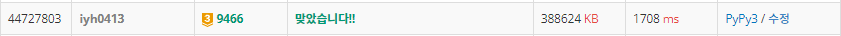

# [Baekjoon] 9466. 텀 프로젝트 [G3]

## 📚 문제 : [텀 프로젝트](https://www.acmicpc.net/problem/9466)

cycle이 있는지 확인하는 문제이다.

하나씩 검색하며 현재 위치로 돌아오는 cycle이 있는지 확인하고 cycle이 형성되지 않을 때의 팀원들의 수를 counting 한다.

n이 커서 적당히 cycle인지 확인하면 시간초과가 발생하여 시간을 줄일 여러가지 방법을 사용했다.

**dfs**로 cycle을 형성하는지 확인한다.

1. 확인하는 정점들을 다 visited 배열에 넣어준다.
2. 확인한 정점이 이미 visited 배열에 존재하는 경우
   1. 현재 cycle에 담겨있는 수인지 확인한다.
      - cycle에 담겨있는 경우는 새로운 cycle인 경우이다.
      - 순환하는 수들만큼 cnt를 증가시켜준다.
   2. cycle에 담겨있지 않는 경우
      - 이전에 이미 확인했던 정점이므로 종료한다.

간단히 말하면 확인하는 수는 모두 visited 배열에 담고, 현재 순환하는지 확인하는 수들은 cycle에 담으면서, visited배열에 담겨있는 수를 또 확인한 경우는 현재 순환하는지 확인 후 순환하는 개수만큼 증가시켜준다.

## 📒 코드

```python
import sys
sys.setrecursionlimit(100005)


def dfs(x):     # cycle 확인
    global cnt
    visited[x] = 1
    cycle.append(x)
    if visited[arr[x]]:      # 다른 cycle에 연결되는 건 X
        if arr[x] in cycle:       # 방문했던 정점을 또 방문한 경우 cycle O
            for cycle_num in cycle[::-1]:
                cnt += 1                    # cycle이 형성된 개수만큼 cnt 증가
                if arr[x] == cycle_num:     # cycle이 끝나면 종료
                    break
        return
    return dfs(arr[x])


t = int(input())
for _ in range(t):
    n = int(input())
    arr = [0] + list(map(int, input().split()))     # 1부터이니 앞에 padding으로 0 추가
    cnt = 0
    visited = [0 for _ in range(n + 1)]            # cycle이 완성된 수들은 제외
    for i in range(1, n + 1):
        if visited[i]:         # cycle이 완성됐던 수면 pass
            continue
        cycle = []       # cycle을 이루는지 dfs를 탐색하며 값을 담아준다.
        dfs(i)

    print(n - cnt)
```

## 🔍 결과

