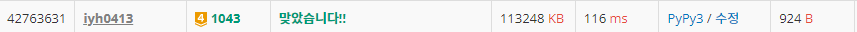

# [Baekjoon] 1043. 거짓말 [G4]

## 📚 문제 : [거짓말](https://www.acmicpc.net/problem/1043)

---

## 📖 풀이

진실을 아는 사람이 포함되는 모든 파티에서는 거짓말을 하지 않는다. 따라서 모든 사람들의 연결요소를 찾아야 한다. 따라서 유니온 파인드를 활용한다.

union으로 연결할 때 진실을 아는 사람이 부모가 되는 방향으로 합쳐나간다.

둘 다 진실을 알지 않다면, 부모가 누가 되는지는 상관 없다.

파티에 5명이 참석하면 첫번째 사람을 2~4번째 사람과 union 연산을 한다. 그럼 5명을 합집합으로 연결한 것이 된다.

모든 파티에서 연결해줬으면, 다시 파티를 순회하며 첫번째 사람의 부모가 진실을 아는 사람들의 집합에 속해있는지 확인한다.

속해있으면 파티를 갈 수 없고, 속하지 않으면 파티에 참석할 수 있다.

## 📒 코드

```python
def find(x):
    if x != par[x]:
        par[x] = find(par[x])       # 경로압축
    return par[x]


def union(a, b):
    a = par[a]
    b = par[b]
    if a in trues:      # 진실을 아는 사람이 부모가 되는 방향으로 합친다.
        par[b] = a
    else:
        par[a] = b


n, m = map(int, input().split())
trues = list(map(int, input().split()))     # 진실을 아는 사람들
arr = [list(map(int, input().split())) for _ in range(m)]
par = [i for i in range(n + 1)]
cnt = m         # 모든 파티에 참석하는 경우를 default로

if trues[0]:
    trues = trues[1:]
    for i in range(m):
        if arr[i][0] == 1:      # 파티에 혼자 참석하는 경우
            continue
        for j in range(2, len(arr[i])):     # 각각의 파티원들을 하나의 합집합으로 연결한다.
            if find(arr[i][1]) == find(arr[i][j]):      # 이미 같은 집합에 속해있는 경우
                continue
            union(arr[i][1], arr[i][j])     # 첫번째 사람과 나머지 사람들을 한 번씩 연결한다.
    
    for i in range(m):          # 파티를 다시 순회하며 진실을 아는 사람들의 집합에 속해있는 지 확인
        if find(arr[i][1]) in trues:    # 어차피 다 합집합으로 연결되어있으니 한 명만 파악하면 된다.
            cnt -= 1

print(cnt)      # 갈 수 있는 파티의 개수를 출력한다.
```


## 🔍 결과


