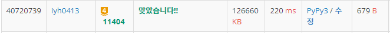

# [Baekjoon] 11404. 플로이드 [G4]

## 📚 문제

https://www.acmicpc.net/problem/11404

---

## 📖 풀이

처음에 어떻게 해결해야할지 한참 생각했는데, BFS로 탐색하는 경우 중복되는 값이 너무 많아 해결할 방법이 떠오르지 않았다. 따라서 해답을 찾아보니 플로이드 워셜 알고리즘을 이용하는 문제이다.

**플로이드 워셜 알고리즘**에 대해 우선적으로 학습하였다.

**모든 정점**에서 **최단경로**를 구할 때 사용하는 알고리즘이다.

플로이드 워셜 알고리즘은 정점의 수가 적고, 간선의 수가 많을 때 활용한다.

O(n^3)인데 n이 100이므로 n^3이 백만정도로 충분히 가능하다.

> 플로이드 워셜 알고리즘 대략 설명
>
> 참고 : **https://blog.naver.com/ndb796/221234427842**

정점을 2차원 배열에 y축에는 시작 정점, x축에는 도착 정점으로 값에는 비용의 최솟값을 담는다.

문제에 주어진 직통 비용을 담는 것이다.

문제에서는 (시작 노드, 도착 노드)가 겹치는 경우가 있으니 비용의 최솟값으로 넣어준다.

직통 버스가 없는 경우는 앞으로 최솟값을 넣을 것이니 그 값보다 크게 나올 값을 넣어준다.

100000이 비용이고 최대 경유할 시 100군데를 찍고 가게 되니 100000*100보다 크거나 같은 값을 넣어준다.


경유할 정점을 하나씩 고른다.

정점을 고르는 순서는 상관 X, 그렇지만 모든 정점을 골라야하니 그냥 오름차순으로 고른다.


선택한 정점을 X라고 하면, 선택한 정점을 경유해야하니 시작 정점과 끝 정점은 X와 달라야한다.

> ex). A -> X, X -> B 중 A, B가 X와 달라야 경유하는 것이다.

경유했을 때 비용과, 경유하지 않았을 경우의 비용을 비교해 최솟값으로 넣어준다.

모든 정점을 비교하면 비용의 최솟값으로 업데이트 된다.

갈 수 없는 경우는 초기값으로 넣어준 1000000이 있게 되니 이 경우만 0으로 바꾸고 출력한다.

## 📒 코드

```python
import sys
input = sys.stdin.readline

n = int(input())
m = int(input())
arr = [[10000000]*(n + 1) for _ in range(n + 1)]
for _ in range(m):
    s, e, fee = map(int, input().split())
    arr[s][e] = min(arr[s][e], fee)

# 플로이드 워셜 알고리즘 이용!
for k in range(1, n + 1):           # 정점을 순차적으로 수행
    for i in range(1, n + 1):
        if k == i:
            continue
        for j in range(1, n + 1):
            if k == j or i == j:    # 경유해야하니 정점이 달라야 한다.
                continue
            arr[i][j] = min(arr[i][j], arr[k][j] + arr[i][k])   # 경유할 때와 현재 값과 비교

for i in range(1, n + 1):   # 10000000을 0으로 변경
    for j in range(1, n + 1):
        if arr[i][j] == 10000000:
            arr[i][j] = 0

for i in range(1, n + 1):
    print(*arr[i][1:])
```

## 🔍 결과

