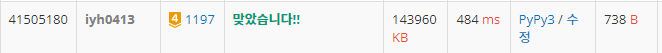

# [Baekjoon] 1197. 최소 스패닝 트리 [G4]

## 📚 문제

https://www.acmicpc.net/problem/1197

---

## 📖 풀이

최소 신장 트리인 **최소 스패닝 트리**를 구하는 문제이다. **크루스칼 알고리즘**을 활용한다.

**Union-Find 알고리즘**으로 사이클이 없게 만든다.

입력된 간선을 가중치로 정렬해 가중치가 작은 것부터 채워나간다.

## 📒 코드

```python
def find(x):            # 루트를 찾아준다.
    if x != root[x]:
        root[x] = find(root[x])     # 경로 압축
    return root[x]


def union(a, b):        # 합쳐준다. 루트를 같게 변경
    r_a = find(a)
    r_b = find(b)
    if r_a > r_b:       # 숫자가 큰 걸 작은 것에 맞춰 변경
        root[r_a] = root[r_b]
    else:
        root[r_b] = root[r_a]


v, e = map(int, input().split())
edges = sorted([list(map(int, input().split())) for _ in range(e)], key=lambda x:x[2])   # 가중치로 정렬
root = [i for i in range(v + 1)]    # 루트 배열을 자기 자신으로 초기화

cnt, total = 0, 0
for v1, v2, w in edges:
    if cnt == v - 1:            # 모든 정점이 연결된 경우 종료
        break
    if find(v1) != find(v2):    # 두 정점의 루트 값이 다른 경우
        cnt += 1
        total += w
        union(v1, v2)

print(total)
```

## 🔍 결과

