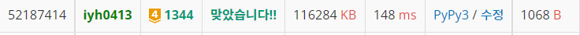

# [Baekjoon] 1344. 축구 [G4]

## 📚 문제 : [축구](https://www.acmicpc.net/problem/1344)

## 📖 풀이

**DP**로 해결해야 하는 문제이다.

5분 당으로 쪼개면 90분이니 18번이다.

1번 당(5분 당) 나올 수 있는 경우의 수는 최대 한 골만 넣을 수 있으니 아래와 같이 4가지이다.

> 0:0 1:0 0:1 1:1

따라서 18의 4제곱을 하면 100억 가량 되어 완전탐색으로 해결하려고 하면 시간초과가 발생한다.

DP를 활용해 반복된 계산을 줄이며 해결해나간다.

dp에는 현재 몇번째 판인지, a팀의 골 수, b팀의 골 수에 따른 확률을 저장한다.

dp에는 90분이 다 지나가고 둘 중 한 팀이라도 소수인 경우 계산된 확률 값을 넣어주고 아니라면 0을 넣어준다.

탑다운 DP로 적어 위에서 구상한 생각대로 간단히 구현한다.

확률을 100으로 나누지 않고 마지막에만 100의 36제곱으로 나눠 계산한다. 중간 계산과정에서 100에서 확률을 뺀 후 곱해줘야 한다.

## 📒 코드

```python
def recur(cur, a_goals, b_goals, per):
    # 반복해서 계산하는 값인지 확인
    if dp[cur][a_goals][b_goals] != -1:
        return dp[cur][a_goals][b_goals]

    # 90분이 다 지나간 경우
    if cur == 18:
        # 둘중 하나라도 소수인지 확인
        if a_goals in sosus or b_goals in sosus:
            return per
        else:
            return 0

    ans = 0
    # 경우의 수 4가지
    # 둘 다 골 못 넣는 경우
    ans += recur(cur + 1, a_goals, b_goals, per *
                 (100 - a_per) * (100 - b_per))
    # a만 골 넣는 경우
    ans += recur(cur + 1, a_goals + 1, b_goals, per * a_per * (100 - b_per))
    # b만 골 넣는 경우
    ans += recur(cur + 1, a_goals, b_goals + 1, per * (100 - a_per) * b_per)
    # 둘 다 골 넣는 경우
    ans += recur(cur + 1, a_goals + 1, b_goals + 1, per * a_per * b_per)

    # dp에 값 저장
    dp[cur][a_goals][b_goals] = ans
    return ans


a_per = int(input())
b_per = int(input())
sosus = [2, 3, 5, 7, 11, 13, 17]
dp = [[[-1] * 19 for _ in range(19)] * 19 for _ in range(19)]
print(recur(0, 0, 0, 1) / (100 ** 36))

```

## 🔍 결과

