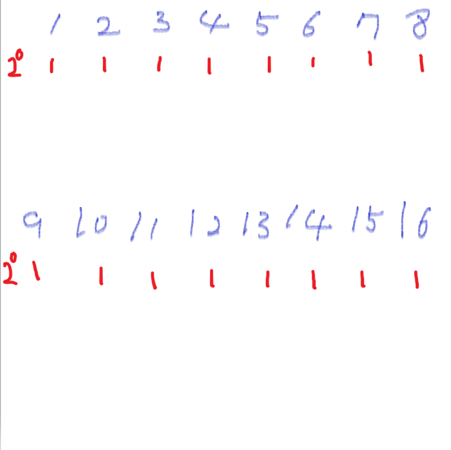
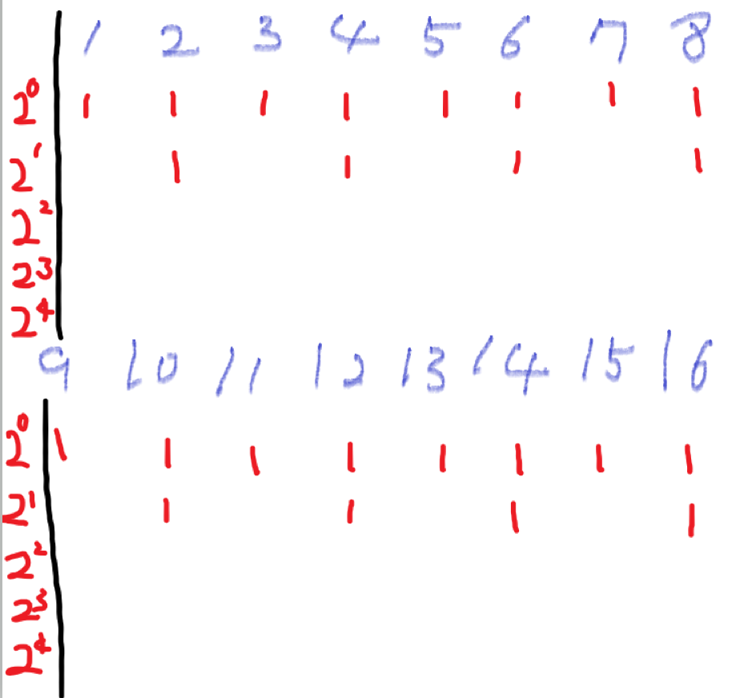
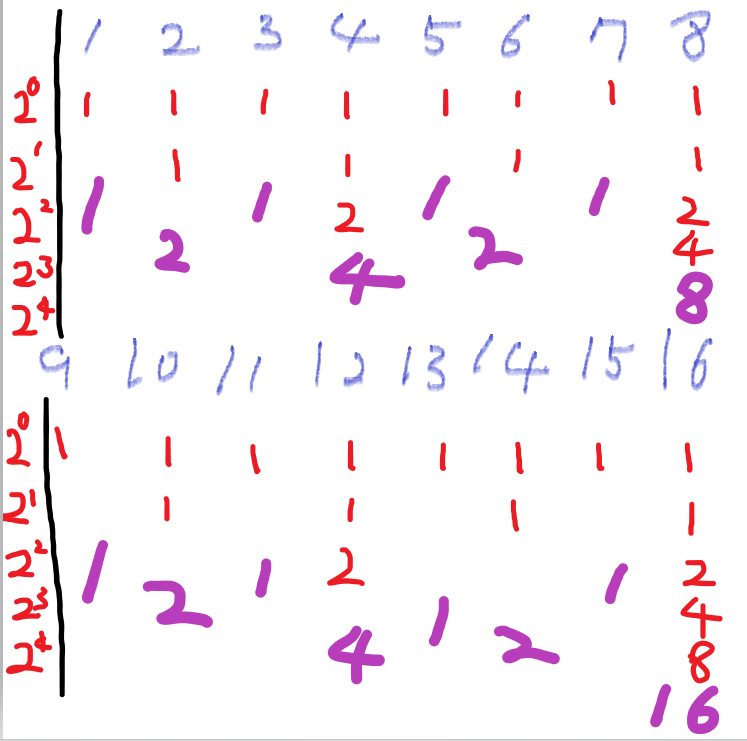
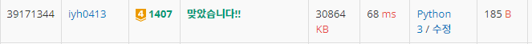

# [Baekjoon] 1407. 2로 몇 번 나누어질까 [G4]

## 📚 문제

https://www.acmicpc.net/problem/1407

---

> 1~n까지 정수 중 k의 배수의 개수는 n//k이다.

B까지의 배수의 개수 - (A-1)까지의 배수의 개수 = [A, B] 사이의 배수의 개수이다.

2<sup>1</sup>, 2<sup>2</sup>,...,2<sup>m</sup>의 배수 값을 찾아야 하니 B보다 작거나 같은 2<sup>m</sup>의 최댓값을 찾아야 한다.

> 2<sup>max</sup> <= B < 2<sup>max+1</sup>

B를 2로 나누다가 B가 2보다 작아지는 순간, 그때까지 나눈 횟수 값이 최댓값이다.

그럼 이제 2의 배수는 2, 4의 배수는 4, 8의 배수는 8 .... 으로 구해야 하니 해당 **2의 거듭제곱의 절반 값**을 더해주면 된다.

2<sup>k </sup>+ 2<sup>k</sup> = 2<sup>k+1</sup>

그림을 설명하면

1. 먼저 1을 다 넣어준다.

   

2. 그 다음 2의 배수에는 2<sup>1</sup>을 넣어줘야하는데 자리에 2<sup>0 </sup>이 있으니 2<sup>0 </sup>을 더해 2<sup>1</sup>을 만들어 준다.

   

3. 그다음에는 2<sup>2</sup>의 배수에는 2<sup>2</sup>을 넣어줘야하는데 자리에  2<sup>1</sup>이 있으니  2<sup>1</sup>을 더해 2<sup>2</sup>을 만들어 준다. 이걸 반복한다. 지금  최대가 16이니 2<sup>4</sup>까지 반복한다.

   

다음과 같이 구할 수 있다.

## 📒코드

```python
A, B = map(int, input().split())
b = B # B 이하의 2의 거듭제곱이 존재하는 영역까지 구하기 위해 나누어줄 B 값
exp = 0         # 2의 지수
sum = B-A+1     # 먼저 전 영역에 1을 다 더해준다.
while b >= 2:   # 더 이상 2의 배수가 없을 때까지
    b //= 2     # B보다 작은 2의 거듭제곱으로 나누어주기 위해 계속 나누며 확인한다.
    exp += 1    # 2의 지수를 1 더한다.
    two_exp = 2**exp    # 2의 거듭제곱 값
    sum += (B//two_exp - (A-1)//two_exp) * (two_exp//2) # [A, B] 영역에서 배수의 개수에 2의 거듭제곱의 절반을 곱한다.
print(sum)
```

## 🔍 결과


