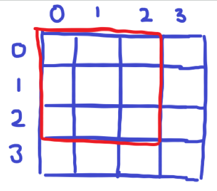
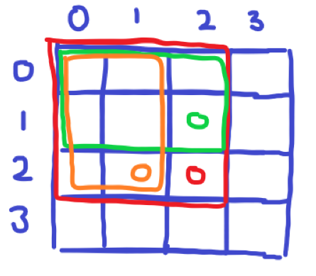
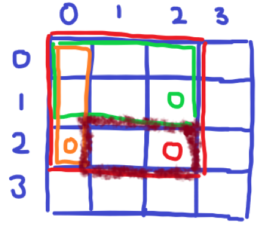

# [Baekjoon] 14846. 직사각형과 쿼리 [G4]

## 📚 문제

https://www.acmicpc.net/problem/14846

---

## 📖 풀이

서로 다른 정수의 개수를 구하는 문제!!

범위가 주어져 있는데 2차원이니 **2차원 누적합**으로 해결한다.

딕셔너리로 key에는 수를 값에는 개수를 넣어준다.

수의 범위가 1~10이라서 굳이 딕셔너리를 안 쓰고 카운팅 배열을 써도 된다!

1. ### 누적합을 구한다.

기준점을 정해야하는데 (0, 0)을 기준점으로 삼는다.(그림 그릴 땐 (0, 0)으로 잡았는데 문제에 1부터 표현하여 padding을 더해 (1, 1)을 기준점으로 잡았다!)

(0, 0)과 (a, b) 사이에 서로 다른 수의 개수를 (a, b) 값에 넣어준다.

그림으로 누적합을 어떻게 넣는지 설명해보면,



(2, 2)는 저 빨간 네모 박스에서의 값을 구하는 것이다.



초록 박스와 주황 박스의 값을 딕셔너리로 합쳐주고 겹치는 부분을 빼준다. 원래 배열에 빨간점이 포함되어있다.

이 때 위 그림에는 인덱스를 0부터 표현했지만 문제에서 1부터 시작하므로 padding으로 테두리를 감싸 처리한다.

그리고 누적합을 계산할 때 이전 값을 건들여야 하므로 padding을 하고 구하는 것이 편하다.


2. ### 범위에서 중복된 수들을 구해준다.



위 그림처럼 (2, 1) 에서 (2, 2)를 구한다고 생각해보자.

그러면 먼저 빨간 점에는 빨간 박스에 수와 각각 중복된 갯수가 담겨있다.

주황박스와 초록박스에 있는 수를 빼주고 겹치는 부분인 (1, 0)의 값을 더해준다.

그리고 나서 0이 아닌(0보다 큰) key 값의 개수만 세준다.

## 📒 코드

```python
import sys
input = sys.stdin.readline

n = int(input().rstrip())
arr = [[{}] * (n + 1)] + [[{}] + list(map(lambda x: {int(x) : 1}, input().split())) for _ in range(n)]
q = int(input().rstrip())
for i in range(1, n + 1):
    for j in range(1, n + 1):
        for k, v in arr[i][j - 1].items():
            arr[i][j][k] = arr[i][j].get(k, 0) + v
        for k, v in arr[i - 1][j].items():
            arr[i][j][k] = arr[i][j].get(k, 0) + v
        for k, v in arr[i - 1][j - 1].items():
            arr[i][j][k] -= v

for _ in range(q):
    result = {}
    cnt = 0
    x1, y1, x2, y2 = map(int, input().split())
    for k, v in arr[x2][y2].items():
        result[k] = v
    for k, v in arr[x2][y1 - 1].items():
        result[k] -= v
    for k, v in arr[x1 - 1][y2].items():
        result[k] -= v
    for k, v in arr[x1 - 1][y1 - 1].items():
        result[k] += v
    for k, v in result.items():
        if v > 0:
            cnt += 1
    print(cnt)
```

## 🔍 결과

