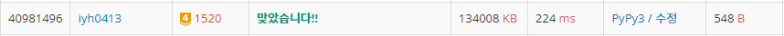

# [Baekjoon] 1520. 내리막 길 [G4]

## 📚 문제

https://www.acmicpc.net/problem/1520

---

## 📖 풀이

**DP 탑다운** 방식으로 풀었다.

DFS 백트래킹을 활용했고, DP에 나왔던 값은 저장해서 사용한다.

시작부분을 넣고 재귀를 호출하면 계속 재귀를 타고 들어가 `arr(-1, -1)`인 맨 끝까지 재귀로 들어가 안쪽부터 구한다.

탑다운 방식으로 해결하면 코드가 깔끔하다.

구하면서 갈림길에서는 썼던 값을 사용하기 위해 DP를 활용하는 것이다.

4방향으로 탐색하면서 나아가야하니 델타 탐색을 활용하고, 어차피 지나간 곳을 되돌아가려면 오르막이라 따로 처리안해줘도 된다.

찾다가 길이 없으면 0을 return하면 되니 ret을 0으로 초기화 한 후 계산한다.

## 📒 코드

```python
def recur(x, y):
    if x == m - 1 and y == n - 1:
        return 1
    ret = 0
    if dp[x][y] != -1:
        ret = dp[x][y]
    else:
        for i in range(4):
            nx = x + dx[i]
            ny = y + dy[i]
            if 0 <= nx < m and 0 <= ny < n and arr[x][y] > arr[nx][ny]:
                ret += recur(nx, ny)
        dp[x][y] = ret
    return ret


m, n = map(int, input().split())
arr = [list(map(int, input().split())) for _ in range(m)]
dx = [0, 1, 0, -1]
dy = [1, 0, -1, 0]
dp = [[-1] * n for _ in range(m)]

print(recur(0, 0))
```

## 🔍 결과

