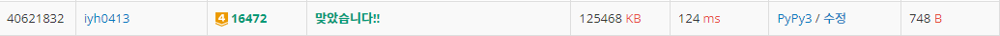

# [Baekjoon] 16472. 고냥이 [G4]

## 📚 문제

https://www.acmicpc.net/problem/16472

---

## 📖 풀이

**투포인터** 문제이다.

s는 시작부분에서 시작하고 e는 인식할 수 있는 최대 길이까지 증가한다.

최대 길이를 넘어서면 e는 같은 문자가 끝날 때까지 이동하고, s는 다른 문자를 만날 때까지 이동한다. 다음을 반복한다.

- input

```
2
abbcaccba
```

인식할 수 있는 문자가 입력된 문자열 이하면 최대 길이와 비교하여 바꾸어 준다.

문자가 몇 개 있는지는 **딕셔너리** 자료구조를 활용한다.

key의 개수를 확인하여 문자가 몇 개 있는지 확인한다.

e가 움직이면 딕셔너리에 값을 추가하고, s가 움직이면 딕셔너리에 값을 뺀다. 딕셔너리의 값이 0이면 key를 제거한다.


s, e가 a에서 시작한다. 

`dic = {'a': 1}`

인식할 수 있는 문자가 2개이므로 e를 전진시킨다. b를 딕셔너리에 추가한다.

최대 길이: 1

| 문자열 | a    | b    | b    | c    | a    | c    | c    | b    | a    |
| ------ | ---- | ---- | ---- | ---- | ---- | ---- | ---- | ---- | ---- |
| 포인터 | s,e  |      |      |      |      |      |      |      |      |


`dic = {'a': 1, 'b': 1}`

문자가 몇 개 있는지는 딕셔너리 key의 개수를 확인한다.

인식할 수 있는 문자 개수를 넘지 않았으므로 최대 길이를 업데이트하고 e를 전진한다.

최대 길이: 2

| 문자열 | a    | b    | b    | c    | a    | c    | c    | b    | a    |
| ------ | ---- | ---- | ---- | ---- | ---- | ---- | ---- | ---- | ---- |
| 포인터 | s    | e    |      |      |      |      |      |      |      |


`dic = {'a': 1, 'b': 2}`

인식할 수 있는 문자 개수를 넘지 않았으므로 최대 길이를 업데이트하고 e를 전진한다.

최대 길이: 3

| 문자열 | a    | b    | b    | c    | a    | c    | c    | b    | a    |
| ------ | ---- | ---- | ---- | ---- | ---- | ---- | ---- | ---- | ---- |
| 포인터 | s    |      | e    |      |      |      |      |      |      |


`dic = {'a': 1, 'b': 2, 'c': 1}`

문자열 개수를 초과한다. 따라서 s를 이동시킨다. 이 때에는 최대 길이를 업데이트 해주지 않는다. 그리고 a는 하나 밖에 없으니 제거해준다.

최대 길이: 3

| 문자열 | a    | b    | b    | c    | a    | c    | c    | b    | a    |
| ------ | ---- | ---- | ---- | ---- | ---- | ---- | ---- | ---- | ---- |
| 포인터 | s    |      |      | e    |      |      |      |      |      |


`dic = {'b': 2, 'c': 1}`

이동시키니 개수가 다시 2개이다. 최대 길이 값이 같으니 업데이트 하지 않는다.

다시 e를 이동시킨다.

최대 길이: 3

| 문자열 | a    | b    | b    | c    | a    | c    | c    | b    | a    |
| ------ | ---- | ---- | ---- | ---- | ---- | ---- | ---- | ---- | ---- |
| 포인터 |      | s    |      | e    |      |      |      |      |      |


`dic = {'a': 1, b': 2, 'c': 1}`

문자열 개수를 초과한다. {a, b, c} 따라서 s를 움직인다.

최대 길이: 3

| 문자열 | a    | b    | b    | c    | a    | c    | c    | b    | a    |
| ------ | ---- | ---- | ---- | ---- | ---- | ---- | ---- | ---- | ---- |
| 포인터 |      | s    |      |      | e    |      |      |      |      |


`dic = {'a': 1, b': 1, 'c': 1}`

이 때에도 {a, b, c}로 문자열 개수를 초과하니 s를 움직인다.

최대 길이: 3

| 문자열 | a    | b    | b    | c    | a    | c    | c    | b    | a    |
| ------ | ---- | ---- | ---- | ---- | ---- | ---- | ---- | ---- | ---- |
| 포인터 |      |      | s    |      | e    |      |      |      |      |


`dic = {'a': 1, 'c': 1}`

현재 길이는 최대 길이보다 작으니 업데이트 하지 않는다. 최대 개수랑 동일하니 e를 움직인다. 

최대 길이: 3

| 문자열 | a    | b    | b    | c    | a    | c    | c    | b    | a    |
| ------ | ---- | ---- | ---- | ---- | ---- | ---- | ---- | ---- | ---- |
| 포인터 |      |      |      | s    | e    |      |      |      |      |


`dic = {'a': 1, 'c': 2}`

{a, c} 문자열 개수를 초과하지 않는다. 현재 길이는 최대 길이와 같으니 업데이트 하지 않는다. 최대 개수랑 동일하니 e를 움직인다. 

최대 길이: 3

| 문자열 | a    | b    | b    | c    | a    | c    | c    | b    | a    |
| ------ | ---- | ---- | ---- | ---- | ---- | ---- | ---- | ---- | ---- |
| 포인터 |      |      |      | s    |      | e    |      |      |      |


`dic = {'a': 1, 'c': 3}`

{a, c} 문자열 개수를 초과하지 않는다. 현재 길이는 최대 길이보다 크니 업데이트 한다. 최대 개수랑 동일하니 e를 움직인다. 

**최대 길이: 4**

| 문자열 | a    | b    | b    | c    | a    | c    | c    | b    | a    |
| ------ | ---- | ---- | ---- | ---- | ---- | ---- | ---- | ---- | ---- |
| 포인터 |      |      |      | s    |      |      | e    |      |      |


`dic = {'a': 1, 'c': 3, 'b': 1}`

{a, b, c} 문자열 개수를 초과하니 s를 초과하지 않을 때까지 움직인다. c를 하나 빼고 a도 하나 뺀다.

최대 길이: 4

| 문자열 | a    | b    | b    | c    | a    | c    | c    | b    | a    |
| ------ | ---- | ---- | ---- | ---- | ---- | ---- | ---- | ---- | ---- |
| 포인터 |      |      |      | s    |      |      |      | e    |      |


`dic = {'c': 2, 'b': 1}`

문자열 개수를 초과하지 않는다. 현재 길이가 최대길이보다 작으니 업데이트 하지 않는다. e를 전진시킨다.

최대 길이: 4

| 문자열 | a    | b    | b    | c    | a    | c    | c    | b    | a    |
| ------ | ---- | ---- | ---- | ---- | ---- | ---- | ---- | ---- | ---- |
| 포인터 |      |      |      |      |      | s    |      | e    |      |


`dic = {c': 2, 'b': 1, 'a': 1}`

{a, b, c} 문자열 개수를 초과하니 s를 초과하지 않을 때까지 움직인다.

최대 길이: 4

| 문자열 | a    | b    | b    | c    | a    | c    | c    | b    | a    |
| ------ | ---- | ---- | ---- | ---- | ---- | ---- | ---- | ---- | ---- |
| 포인터 |      |      |      |      |      | s    |      |      | e    |


`dic = {'b': 1, 'a': 1}`

{b, c} 문자열 개수를 초과하지 않는다. 현재 길이가 최대길이보다 작으니 업데이트 하지 않는다. e를 전진시킨다.

최대 길이: 4

| 문자열 | a    | b    | b    | c    | a    | c    | c    | b    | a    |
| ------ | ---- | ---- | ---- | ---- | ---- | ---- | ---- | ---- | ---- |
| 포인터 |      |      |      |      |      |      |      | s    | e    |


e가 인덱스를 넘으면 종료시킨다. 이 때의 최대 길이를 출력한다.

## 📒 코드

```python
n = int(input())    # 인식할 수 있는 문자 개수
string = input()    # 입력받은 문자열

s, e = 0, 0     # 투포인터
max_l = 0       # 출력할 최대 길이
dic = {}        # s와 e 이내의 문자를 담아준다.
dic[string[e]] = 1      # 시작 문자를 담는다.
while True:
    if n >= len(dic.keys()):  # 문자의 개수가 n 이하일 때만
        max_l = max(max_l, e - s + 1)   # 최대 길이와 비교해서 업데이트
        e += 1                      # e 전진
        if e == len(string):        # e가 인덱스를 초과하면 break
            break
        if dic.get(string[e]):      # 값을 넣어준다.
            dic[string[e]] += 1     # 이미 키가 존재하는 경우
        else:
            dic[string[e]] = 1      # 키가 없는 경우
    else:
        if dic[string[s]] == 1:     # 값을 빼준다.
            del dic[string[s]]      # 개수가 하나인 경우 키를 제거한다.
        else:
            dic[string[s]] -= 1     # 개수가 하나보다 많으면 개수를 하나 뺀다.
        s += 1                      # 문자의 개수가 더 많으면 s 전진

print(max_l)
```

## 🔍 결과

