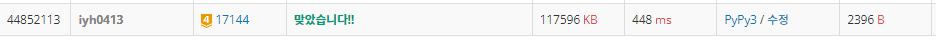

# [Baekjoon] 미세먼지 안녕! [G4]

## 📚 문제 : [미세먼지 안녕!](https://www.acmicpc.net/problem/17144)

1초 동안 아래 적힌 일이 순서대로 일어난다.

1. 미세먼지가 확산된다. 확산은 미세먼지가 있는 모든 칸에서 동시에 일어난다.
   - (r, c)에 있는 미세먼지는 인접한 네 방향으로 확산된다.
   - 인접한 방향에 공기청정기가 있거나, 칸이 없으면 그 방향으로는 확산이 일어나지 않는다.
   - 확산되는 양은 Ar,c/5이고 소수점은 버린다.
   - (r, c)에 남은 미세먼지의 양은 Ar,c - (Ar,c/5)×(확산된 방향의 개수) 이다.
2. 공기청정기가 작동한다.
   - 공기청정기에서는 바람이 나온다.
   - 위쪽 공기청정기의 바람은 반시계방향으로 순환하고, 아래쪽 공기청정기의 바람은 시계방향으로 순환한다.
   - 바람이 불면 미세먼지가 바람의 방향대로 모두 한 칸씩 이동한다.
   - 공기청정기에서 부는 바람은 미세먼지가 없는 바람이고, 공기청정기로 들어간 미세먼지는 모두 정화된다.


## 📖 풀이

구현 문제이다.

1초 지날 때마다 미세먼지를 확산 시키고 공기청정기를 작동시킨다.

배열 복사를 잘 활용해야 한다.

## 📒 코드

```python
def in_range(x, y):     # 범위 안에 있는지 확인
    return 0 <= x < r and 0 <= y < c


def spread():       # 미세먼지 확산
    global arr
    copy_arr = [arr[i][:] for i in range(r)]
    for x in range(r):
        for y in range(c):
            if arr[x][y] > 0:       # 미세먼지가 있는 경우
                for i in range(4):
                    nx = x + dx[i]
                    ny = y + dy[i]
                    if not in_range(nx, ny) or arr[nx][ny] == -1:   # 범위를 벗어나거나 공기청정기인 경우
                        continue
                    copy_arr[nx][ny] += arr[x][y] // 5      # 방향으로 확산
                    copy_arr[x][y] -= arr[x][y] // 5        # 확산한 만큼 가운데 부분의 값을 빼준다.
    arr = [copy_arr[i][:] for i in range(r)]


def on_air():       # 공기청정기 순환
    global arr
    copy_arr = [arr[i][:] for i in range(r)]
    x, y = loc_air, 1       # 공기청정기 윗부분 위치
    copy_arr[x][y] = 0
    for i in [0, 3, 2, 1]:  # 우 상 좌 하
        nx = x + dx[i]
        ny = y + dy[i]
        while in_range(nx, ny) and arr[nx][ny] != -1:       # 배열을 넘어서거나, 공기청정기를 만나면 종료
            copy_arr[nx][ny] = arr[x][y]
            x, y = nx, ny       # 다음 위치로 이동
            nx += dx[i]
            ny += dy[i]

    x, y = loc_air + 1, 1   # 공기청정기 아래부분 위치
    copy_arr[x][y] = 0
    for i in range(4):
        nx = x + dx[i]
        ny = y + dy[i]
        while in_range(nx, ny) and arr[nx][ny] != -1:       # 배열을 넘어서거나, 공기청정기를 만나면 종료
            copy_arr[nx][ny] = arr[x][y]
            x, y = nx, ny       # 다음 위치로 이동
            nx += dx[i]
            ny += dy[i]
    arr = [copy_arr[i][:] for i in range(r)]


r, c, t = map(int, input().split())
arr = [list(map(int, input().split())) for _ in range(r)]       # 미세먼지 상태
dx, dy = [0, 1, 0, -1], [1, 0, -1, 0]   # 우 하 좌 상

for i in range(r):
    if arr[i][0] == -1:
        loc_air = i # 공기청정기 윗부분 x 좌표
        break

for _ in range(t):  # t초 동안 확산과 공기청정기 순환
    spread()
    on_air()

dust = 0
for i in range(r):
    for j in range(c):
        if arr[i][j] > 0:
            dust += arr[i][j]
print(dust)     # 미세먼지 양을 출력
```

## 🔍 결과

