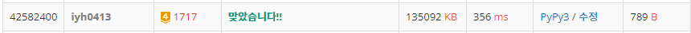

# [Baekjoon] 1717. 집합의 표현 [G4]

## 📚 문제 : [집합의 표현](https://www.acmicpc.net/problem/1717)

---

## 📖 풀이

**유니온 파인드** 문제이다.

find와 union 함수를 먼저 작성한다.

경로 압축과 union-by-rank를 사용하여 최적화한다.

union-by-rank를 사용하기 위해 rank 배열을 만들어 루트를 기준으로 커지는 쪽으로 계속 합쳐지도록 해준다.

경로압축을 사용해 루트 노드까지 이어지는 부모노드과 자신을 전부 루트 노드의 자식 노드로 바꾼다.

위 두 방법은 검색할 때 속도를 줄여줄 수 있다.

## 📒 코드

```python
import sys
input = sys.stdin.readline


def find(x):
    if par[x] != x:
        par[x] = find(par[x])       # 경로 압축
    return par[x]


def union(x, y):
    x = find(x)
    y = find(y)
    if rnk[x] < rnk[y]:     # union-by-rank : 합친 횟수가 적은 쪽에서 많은 쪽으로 병합
        par[x] = y
    elif rnk[x] > rnk[y]:
        par[y] = x
    else:
        rnk[x] += 1
        par[y] = x


n, m = map(int, input().split())
par = [i for i in range(n + 1)]
rnk = [0 for _ in range(n + 1)]

for i in range(m):
    flag, a, b = map(int, input().split())
    if flag:    # 같은 집합에 포함되는지 확인
        if find(a) == find(b):
            print('YES')
        else:
            print('NO')
    else:
        if find(a) != find(b):
            union(a, b)
```

## 🔍 결과

