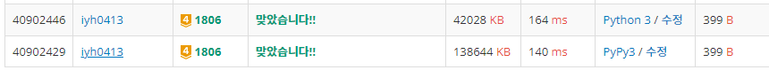

# [Baekjoon] 1806. 부분합 [G4]

## 📚 문제

https://www.acmicpc.net/problem/1806

---

## 📖 풀이

자연수이다. 음수인 경우는 누적합을 활용하는 걸 생각할 수 있는데 양수이므로 **투포인터**로 해결한다.

n개의 수열에서 부분합이 m이상일 때의 최소 길이를 구하는 문제이다.

문제에서는 N, S인데 임의로 바꿨다. 😁

투포인터로 풀어보면, s, e가 시작부분에서 함께 출발한다.

e가 인덱스를 초과하는 경우 반복문을 종료한다.

매번 현재 total 값을 m과 비교해 더 클 때 최소 길이로 업데이트한다.

s와 e가 같은 경우는 무조건 e를 한 칸 전진한다.

s보다 e가 큰 경우는 2가지로 생각한다.

total이 m보다 작은 경우는 수를 더 키워야 하니 e를 전진하면서 total에서 전진한 위치에 있는 값을 더한다.

total이 m보다 큰 경우는 수를 더 줄여야 하니 s를 전진하면서 total에서 s에 있던 값을 뺀다.

## 📒 코드

```python
n, m = map(int, input().split())
arr = list(map(int, input().split())) + [0]
INF = 100_000_001
min_len = INF

s, e = 0, 0
total = arr[e]
while e < n:
        if total >= m:
            min_len = min(min_len, e - s + 1)
        if total < m or s == e:
            e += 1
            total += arr[e]
        else:
            total -= arr[s]
            s += 1

print(0 if min_len == INF else min_len)
```

## 🔍 결과

