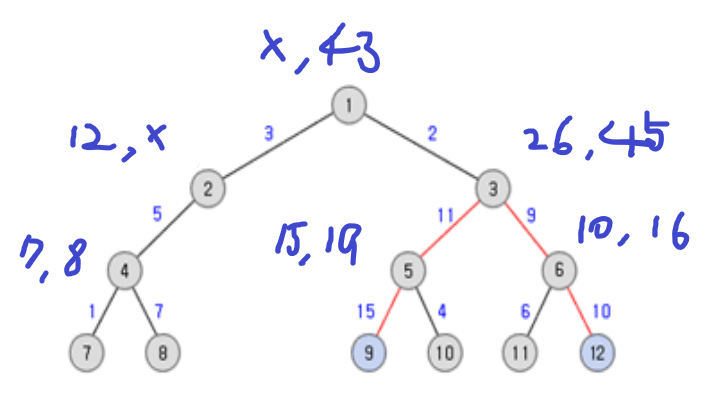
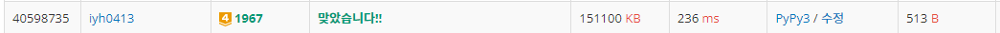

# [Baekjoon] 1967. 트리의 지름 [G4]

## 📚 문제

https://www.acmicpc.net/problem/1967

---

트리는 사이클이 없는 무방향 그래프이다.

모든 경로들 중에서 가장 긴 것을 트리의 지름이라고 한다.

문제에서 주어진 루트 노드는 1이다.


그림으로 어떻게 풀지 생각해본다.

후위 순회를 하며 자식노드부터 확인을 한다.

>분기점에 도달하면 왼쪽에는 분기점에서 가장 긴 길이를 왼쪽에 적는다.
>
>현재 분기점을 최상위 루트로 하는 트리 지름의 길이를 오른쪽에 적는다.
>
>현재 노드가 분기점이 아니면 길이만 더해준다.
>
>최상위 노드에서는 트리 지름의 길이만 적는다.



오른쪽에 적은 값들 중 가장 긴 지름의 값을 확인해보면 3번 노드가 루트 노드로 할 때 서브 트리에서의 트리의 지름이 현재 트리의 지름이 된다.

분기점에서 제일 긴 길이 두 개를 합하여 최댓값으로 업데이트한다. 실질적으로 계속 값을 저장해 갈 값은 왼쪽에 적는 다른 부모를 만날 때 활용할 최대 길이이다.

최대 길이도 저장하기보다는 재귀를 활용해 값을 더하면서 확인한다.

재귀 깊이 에러가 떠 깊이를 늘려줘 해결했다.

## 📒 코드

```python
import sys
sys.setrecursionlimit(10000)    # 재귀 깊이를 늘린다.

def recur(n):
    global total_max
    if arr[n] == []:        # 자식 노드가 없으면 0을 반환
        return 0
    
    result = []
    for c, w in arr[n]:     # 자식 노드를 재귀호출하면서 가중치 값을 더해준다.
        result.append(w + recur(c))

    result.sort()           # 노드에 연결된 길이들을 크기 순대로 정렬한다.
    result = result[::-1][0:2]      # 가장 긴 2개만 남긴다.
    total_max = max(total_max, sum(result))  # 2개를 합한 것이 현재 구한 최대 트리의 지름보다 큰지 확인
        

    return result[0]        # 노드에 연결된 선 중 가장 긴 길이를 리턴


n = int(input())
arr = [[] for _ in range(n + 1)]    # 부모 노드를 인덱스로 하는 리스트(자식노드와 가중치를 담는다.)

for i in range(n - 1):
    p, c, w = map(int, input().split())
    arr[p].append([c, w])   # 부모 노드의 리스트에 자식 노드와 그 때의 가중치를 리스트로 담는다.

total_max = 0   # 가장 긴 트리의 지름
recur(1)
print(total_max)
```

## 🔍 결과

