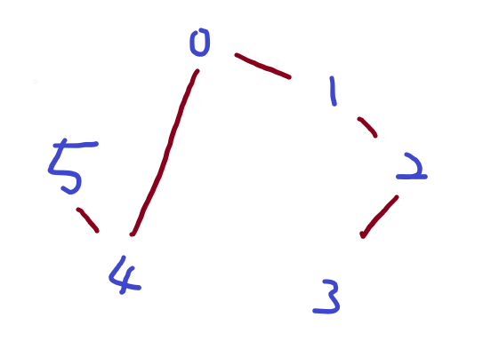
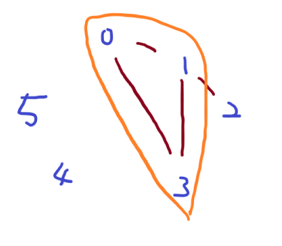
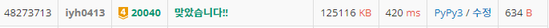

# [Baekjoon] 20040. 사이클 게임 [G4]

## 📚 문제 : [사이클 게임](https://www.acmicpc.net/problem/20040)

## 📖 풀이

사이클이 완성됐는지 언제 완성됐는지 확인하는 문제이다.

예제 1번을 그림으로 그려보면 다음과 같다.

- input

```
6 5
0 1
1 2
2 3
5 4
0 4
```



위 상황은 아직 완성하지 못했으니 0을 출력한다.

완성된 순서를 출력하면 되는데 완성되지 않았으면 0을 출력한다.

예제 2번을 보면,

- input

```
6 5
0 1
1 2
1 3
0 3
4 5
```



네 번째 순서 때 사이클이 완성된다. 따라서 4를 출력하면 된다.


m이 1000000이라 O(m^2)으로만 해결하려해도 안되니 시간 관리에 유의하며 해결한다.

union-find로 해결한다. 연결요소를 확인하며 연결되었던 부분이 또 연결되는 상황은 사이클이 형성되는 상황이다. 따라서 이 때에 index 번호를 출력한다.

## 📒 코드

```python
import sys
input = sys.stdin.readline


def find(x):
    if x != par[x]:
        par[x] = find(par[x])
    return par[x]


def union(x, y):
    x = find(x)
    y = find(y)
    if x == y:      # 사이클 존재
        return True
    if rnk[x] == rnk[y]:
        rnk[x] += 1
        par[y] = x
    elif rnk[x] > rnk[y]:
        par[y] = x
    else:
        par[x] = y

    return False


n, m = map(int, input().split())
par = [i for i in range(n)]
rnk = [0 for _ in range(n)]
ans = 0
for i in range(m):
    x, y = map(int, input().split())
    if union(x, y):     # 사이클이 존재
        ans = i + 1
        break

print(ans)
```

## 🔍 결과

