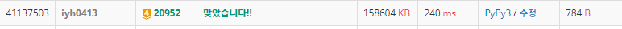

# [Baekjoon] 20952. 게임 개발자 승희 [G4]

## 📚 문제

https://www.acmicpc.net/problem/20952

---

## 📖 풀이

A, B의 길이 100000이라서 2중 for 문 돌리면 무조건 시간초과가 발생한다.

따라서 간단하게 해결할 수 있는지 확인한다.

수열 문제는 규칙성 파악이 중요하다.

- Input

  ```
  7 3
  1 2 4 6 8 15 5
  1 4 6
  ```

1. 7의 배수가 되면 제거하니, A 배열들을 7로 모듈러 연산을 한 0~6에 하나씩 대응시킨다.

   A 배열들의 수를 7로 모듈러 연산을 시행한 후 0 ~ 6 중 속하지 않는 것이 있는지 파악한다.(visited 배열로 등장한 수를 1로 표시한다.)

> 1 2 4 6 8 15 5 각각을 7로 나눈 나머지가 1 2 4 6 1 1 5이므로 1 2 4 5 6을 1로 바꾼다.
>
> visited = [0, 1, 1, 0, 1, 1, 1]

2. B 배열들의 수를 하나씩 순회하면서 값들을 더한다. 합쳐서 7의 배수가 되는 경우를 찾는 것이므로, 더한 수를 7로 모듈러 연산을 시행한 후 7에서 뺀 수가 visited 배열에 있는지 확인한다.(0인 경우는 0으로!)

- B 배열의 첫 번째 수 : 1

> sum = 1
>
> visited[6] = 0

- B 배열의 두 번째 수 : 4

> sum = 5	(1 + 4)
>
> visited[3]은 원래 0이므로 바꾸지 않는다.

- B 배열의 세 번째 수 : 6

> sum = 11	(5 + 6)
>
> visited[1] = 0

3. A 배열에서 visited를 1로 바꿔줄 때 개수를 세준다. 그리고 B 배열에서 visited가 1인 것을 바꾸는 순간 cnt를 하나씩 줄인다.

   왜냐면! 

> 단, 연산을 수행한 결과 수열 A의 모든 원소가 제거된다면 해당 연산은 수행하지 않는다.

​	위 문구를 해결하기 위해서는 아직 다 지워지지 않았는지 확인하는 것이 중요하다.

​	따라서 cnt가 1인 경우는 이제 visited 배열에 나머지 하나를 없애는 순간 배열이 다 사라지는 것이다. 이 때는 연산을 하면 안되므로, cnt가 1인데 visited를 0으로 바꾸는 순간은 continue로 연산과정을 생략한다.

4. sum을 더할 때 마지막에 `10**9 + 7`로 계속 나눠준다. 그 대신 7의 배수가 아니므로, 7로 나눌 때 쓸 sum이랑 마지막에 더해 줄 sum이랑 따로 둬야 한다.

   나는 마지막에 한 번에 더해줄 sum을 ssum 변수로 선언했고, 연산과정에서 계속 7의 배수인지 찾기 위해 check 변수 를 선언해서 사용했다.

5. 마지막에 a 배열을 돌면서 7로 나눈 나머지를 인덱스로 하는 visited 값이 1이면, 위에서 구한 sum을 더한 후 `10**9 + 7`로 나누어준다.

---

지저분하게 설명한 것 같아 크게 정리해보면 다음과 같다.

1. A 배열을 7로 나누었을 때 나머지의 집합으로 나누어 준다.

ex). A 배열이 300개면(무작위로 생각), 7로 나누었을 때 0 ~ 6에 각각 대응시켜 총 합은 300이 된다. 즉, 300개를 7개로 바꿔 생각하는 것이다.

2. B 배열은 모듈러 연산의 성질을 이용해 계속 하나씩 더하며(누적합) 7로 나눈 나머지를 구해 A와 더했을 때 0이 되는 값이 나오는지 확인한다.

   즉, B 배열도 7로 나눈 나머지가 0 ~ 6으로 존재한다.

3. A 배열의 크기가 0이 될 때를 고려해야 한다. 연산을 해 배열이 0이 되면 생략하고 바로 출력하는 줄 알았다. 계속 틀려서 4시간 동안 고민했는데, 연산을 할 수 없으면 생략하고 다음 연산을 이어나가는 것이었다.😢😢

4. `10 ** 9 + 7`은 7로 나누어 떨어지지 않으니 더해주는 과정에서 신경써야 한다. 나는 7로 나누어 떨어지는지 확인할 값과, 마지막에 더해줄 값을 따로 적어 사용했다.

   계속 더한 값은 이후 값을 출력할 때 7의 배수가 아닌 값에 더한 후 `10 ** 9 + 7`로 나눈 나머지를 출력한다.

## 📒 코드

```python
import sys
input = sys.stdin.readline

n, m = map(int, input().split())
arr_a = list(map(int, input().split()))
arr_b = list(map(int, input().split()))
visited = [0 for _ in range(7)]
cnt = 0
for i in range(n):                  # arr_a의 값들 중 7로 나눈 나머지 값들의 존재 유무를 visited에 표시
    if visited[arr_a[i] % 7] == 0:
        visited[arr_a[i] % 7] = 1
        cnt += 1                    # 총 몇 개의 표시를 하는지 확인(최대 7개)
    if cnt == 7:                    # 일곱 개면 더 이상 확인 X
        break

ssum, check = 0, 0                  # 마지막에 더해줄 값, 7로 나누어떨어지는지 확인해줄 값
for i in range(m):
    temp = 7 - (check + arr_b[i]) % 7 if (check + arr_b[i]) % 7 != 0 else 0     # 더해서 7의 배수가 되는지 확인할 값
    if visited[temp]:       # 더해서 7의 배수가 되는데 현재 그 수가 존재하는 경우
        if cnt == 1:        # 배열의 원소가 다 제거되면 연산을 취소
            continue
        visited[temp] = 0   # 동일한 나머지를 가지는 값들을 제거하기 위해 방문 표시를 0으로 변경
        cnt -= 1            # visited에 표시된 개수가 하나 줄어들었다.
    check = (check + arr_b[i]) % 7
    ssum += arr_b[i]        # 값을 더해준다.
    ssum %= 1_000_000_007   # 값을 10 ** 9 + 7로 나눈다.(모듈러 성질)

result = []
for i in range(n):
    if visited[arr_a[i] % 7]:   # 현재 값이 삭제되지 않았으면
        result.append((arr_a[i] + ssum) % 1_000_000_007)    # arr_b에서 더한 값을 더해준 후 10 ** 9 + 7로 나눈다.
print(len(result))
print(*result)
```

## 🔍 결과

