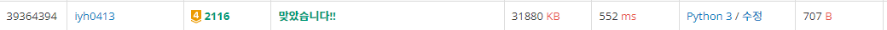

# [Baekjoon] 2116. 주사위 쌓기 [G4]

## 📚 문제

https://www.acmicpc.net/problem/2116

---

맨 아래 주사위의 아랫면이 1~6가지로 정하면 위 아래로 쌓이는 것은 정해진다.

각 주사위의 위 아래 면에 뭐가 나오는지 알면 옆면의 최대값을 알 수 있다.

> 주사위의 위 아래면에 6이 안 나오면 옆면의 최댓값은 6이다.
>
> 주사위의 위 아래면에 6이 나오고 5가 안나오면 옆면의 최댓값은 5이다.
>
> 주사위의 위 아래면에 5, 6이 나오면 옆면의 최댓값은 4이다.

맨 아래 주사위의 면을 정한 후 그 때 쌓으면서 6이나 5, 6이 함께 나오는 경우 cnt를 시켜준다.

6만 나오면 cnt에 1을 더하고,  5와 6이 함께 나오면 cnt를 2 더한다.

맨 위 주사위까지 봤을 때 cnt가 가장 작은 값을 고른다.

## 📒 코드

```python
N = int(input())
arr = [list(map(int, input().split())) for _ in range(N)]
min_cnt = 3 * N     # 6(+1)이나 5, 6(+2)이 나올 때 cnt 세기
for t in range(1, 7):   # 맨 처음 주사위 바닥면 정하기
    cnt = 0
    for i in range(N):
        for j in range(6):
            if arr[i][j] == t:  # 전 주사위의 top과 현재 주사위의 bottom이 같을 때
                b = arr[i][j]
                if j == 0 or j == 5:    # 현재 주사위의 bottom으로 top 구하기
                    t = arr[i][5 - j]
                elif j == 1 or j == 3:
                    t = arr[i][4 - j]
                else:
                    t = arr[i][6 - j]
                if b == 6 or t == 6:    # 주사위의 top과 bottom 중 6이상이 있는지 확인
                    if b == 5 or t == 5:    # 5와 6 둘 다 있는지 확인
                        cnt += 1
                    cnt += 1
                break
    if min_cnt > cnt:   # 6이나 5,6이 젤 조금 나오는 값 선택
        min_cnt = cnt
    
print(6 * N - min_cnt)  # 6이나 5, 6이 안나왔을 경우에서 나오는 경우를 빼줘서 구한다.
```

## 🔍 결과



