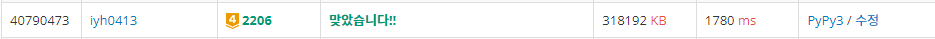

# [Baekjoon] 2206. 벽 부수고 이동하기 [G4]

## 📚 문제

https://www.acmicpc.net/problem/2206

---

## 📖 풀이

최단경로이니 **BFS**로 구현한다.

visited를 3차원으로 표시한다. 2차원의 위치에 [이동거리, 상태]를 넣어준다.

상태는 방문하지 않은 경우 : 2, 벽을 부수고 방문한 경우 : 1, 벽을 부수지 않고 방문한 경우 : 0이다.

이동거리는 최대 이동거리보다 크게 대략 n * m으로 초기화 한다.

상태는 방문하지 않았으므로 2로 초기화한다.

1. 델타 탐색을 할 때 벽을 만나는 경우, 현재 부순 횟수가 0인 경우만 벽으로 이동할 수 있다. 그 때 부순 횟수를 1로 증가시킨다.

   부순 횟수가 1이면 이동하지 않는다.

2. 벽을 만나지 않는 경우에는 2가지로 생각해볼 수 있다.

   1. 부순 횟수가 같거나 큰 경우

      BFS 탐색에서 부순 횟수가 같은 경우는 최단 거리가 아니므로 탐색하지 않는다.

   2. 이동하는 곳의 부순 횟수가 더 많은 경우

      부순 횟수가 더 적은 걸로 더 탐색해봐야 한다.

      처음 탐색하는 곳이면 2이니까 부순 횟수가 0, 1이면 갱신하고,

      부순횟수가 1로 탐색한 경우는 0으로 탐색해볼 수 있다.

반복문을 도는 도중 n-1, m-1 인덱스의 상태가 2가 아니면 값이 들어갔다는 것이니 반복문을 종료하고 출력한다.

반복문이 끝나고도 n-1, m-1 인덱스의 상태가 2이면 -1을 출력한다.

## 📒 코드

```python
import sys
from collections import deque
input = sys.stdin.readline

n, m = map(int, input().split())
arr = [list(map(int, input().rstrip())) for _ in range(n)]
INF = n * m
dy = [0, 1, 0, -1]
dx = [1, 0, -1, 0]
visited = [[[INF, 2] for _ in range(m)] for _ in range(n)]
queue = deque()
queue.append((0, 0))
visited[0][0] = [1, 0]

while queue and visited[n-1][m-1][1] == 2:
    y, x = queue.popleft()
    for i in range(4):
        ny = y + dy[i]
        nx = x + dx[i]
        if not(0 <= ny < n and 0 <= nx < m):
            continue
        if arr[ny][nx] == 0 and visited[y][x][1] < visited[ny][nx][1]:
                visited[ny][nx] = [visited[y][x][0] + 1, visited[y][x][1]]
                queue.append((ny, nx))
        else:
            if visited[y][x][1] == 0 and visited[ny][nx][1] == 2:
                visited[ny][nx] = [visited[y][x][0] + 1, 1]
                queue.append((ny, nx))

if visited[n-1][m-1][1] == 2:
    print(-1)
else:
    print(visited[n-1][m-1][0])
```

## 🔍 결과

