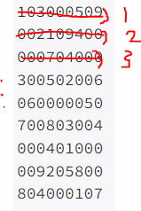

# [Baekjoon] 2239. 스도쿠 [G4]

## 📚 문제

https://www.acmicpc.net/problem/2239

---

백트래킹 문제이다.



위 사진처럼 왼쪽 위에서 시작해 0이 있으면 값을 1~9로 넣으면서 찾아준다. 백트래킹으로 재귀함수를 사용한다. 

가로, 세로, 3x3 박스를 확인하며 넣어준다. 체크할 때 함수를 따로 사용한다. 가로와 세로에 값이 있는지 확인해주고, 3x3 박스에 있는지 확인하기위해 범위를 아래처럼 넣어준다.

- 3x3 범위 체크

>```python
>for i in range((y // 3) * 3, (y // 3) * 3 + 3):
>    for j in range((x // 3) * 3, (x // 3) * 3 + 3):
>```
>
>좌표 값을 3으로 나눈 몫에 3을 곱하면 0, 3, 6으로 떨어진다.

값을 하나 넣어주면 재귀함수에 들어가 다음 0이 있는 곳을 찾아 값을 체크해서 넣어준다. 

(8, 8)까지 가면 값을 출력하고 `exit()`을 사용하여 종료시켜 준다.

## 📒 코드

```python
def check(y, x, num):
    # 행과 열 체크
    for k in range(9):
        if arr[y][k] == num or arr[k][x] == num:
            return False

    # 3x3 체크
    for i in range((y // 3) * 3, (y // 3) * 3 + 3):
        for j in range((x // 3) * 3, (x // 3) * 3 + 3):
            if arr[i][j] == num:
                return False
    return True     # 행렬, 3x3에 같은 숫자가 없으면 리턴 True


def recur(y, x):
    while arr[y][x] != 0:
        if x == 8:      # x좌표가 끝까지 가는지 확인
            if y == 8:  # (8, 8)에 도착하면 출력한다.
                for i in range(9):
                    print(''.join(map(str, arr[i])))
                exit()  # 출력하고 종료
            x = 0       # x좌표를 0으로 가고 y좌표를 한 칸 내린다.
            y += 1
        else:
            x += 1      # 아니면 x좌표를 한 칸 전진

    for i in range(1, 10):  # 1 ~ 9를 순차적으로 넣어준다.
        if check(y, x, i):  # check 함수에서 true가 나올 때만
            arr[y][x] = i
            recur(y, x)
            arr[y][x] = 0

arr = [list(map(int, input())) for _ in range(9)]
recur(0, 0)
```

## 🔍 결과


