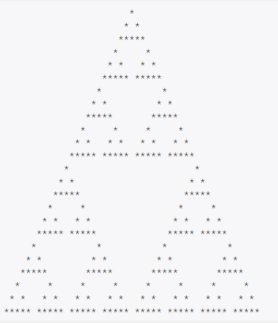

# [Baekjoon] 2448. 별 찍기 - 11 [G4]

## 📚 문제 : [별 찍기 - 11](https://www.acmicpc.net/problem/2448)

## 📖 풀이



25가 입력으로 들어올 때, 예제는 위와 같다.

N이 3 6 12 24 48 ...로 들어온다고 한다.

N은 층의 개수이다.

N이 3일 때는

```
  *
 * *
*****
```

N이 6일 때는

```
     *
    * *
   *****
  *     *
 * *   * *
***** *****
```

먼저 현재 삼각형의 문자열을 배열에 담는다.

각 문자열의 길이는 같다.

N이 3일 떄는 5이고 N이 6일 때는 11이다.

배열에 담았으면 윗 삼각형이랑 아래 두 개의 삼각형으로 나눠서 구한다.

1. 윗 삼각형

   현재 문자열의 길이에 1을 더하고 2로 나눈 공백을 앞뒤로 더해준다.

2. 아래 두 개의 삼각형

   현재 문자열에 ' ' 공백하나 넣어주고 같은 문자열을 똑같이 넣어준다.

위 규칙으로 해결하면 된다!

## 📒  코드

```python
n = int(input())
arr = ['  *  ', ' * * ', '*****']
while n > len(arr):
    nxt_arr = []
    for s in arr:
        nxt_arr.append(' ' * ((len(s) + 1) // 2) + s + ' ' * ((len(s) + 1) // 2))
    for s in arr:
        nxt_arr.append(s + ' ' + s)
    arr = nxt_arr[:]
for i in range(n):
    print(arr[i])
```

## 🔍 결과


