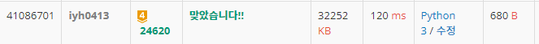

# [Baekjoon] 24620. Drought [G4]

## 📚 문제

https://www.acmicpc.net/problem/24496

---

모든 수를 똑같이 만드는 것이 목표이다.

처음에 배열의 값을 바꾸면서 계산해보려고 했는데 시간복잡도 안에서 해결이 어렵다.. 그리고 구상자체가 그려지지 않는다.

이진탐색으로도 못푸는데 그 이유는,  3을 통일할 수 있다고 해도 4, 5 이상의 수들은 될 수도 안될 수도 있다. 따라서 이진탐색도 불가능하다.

입력된 걸 모두 한 가지의 수로 만드니 **약수**로만 만들 수 있다는 아이디어가 떠올랐다.

약수라는 아이디어가 중요하다. 따라서 **매개변수 탐색**을 통해 약수일 때 가능한지 체크한다.!!

누적합으로도 가능하다.

`1 2 3 1 1 1`의 누적합은 `1 3 6 7 8 9` 이다.

 => 맨 마지막 인덱스의 수 이하의 3의 배수가 다 들어가면 3이 가능하다!

따라서 매개변수 탐색할 때 하나의 방법으로 누적합을 활용가능하다.

그렇지만 누적합이 아니어도 일정한 수로 만들 수 있는지 체크하는 건 합해주면서 하면 되니까 누적합을 활용하지 않고 해결했다.

## 📒 코드

```python
def check(x):   # 매개변수 탐색, x가 가능한지 확인
    total = 0
    for i in range(n):
        if total > x:
            return False
        total += arr[i]
        if total == x:
            total = 0
    return True


for _ in range(int(input())):
    n = int(input())
    arr = list(map(int, input().split()))
    mmax = 0
    total = 0
    zero_cnt = 0

    for i in range(n):      # 최댓값, 최솟값 구하기
        if mmax < arr[i]:
            mmax = arr[i]
        if arr[i] == 0:
            zero_cnt += 1
        total += arr[i]

    ans = 0
    for i in range(max(1, mmax), total + 1):    # 최댓값 이상부터 가능하니 그 때부터 체크
        if total % i == 0 and check(i):         # 나누어떨어지면 그 수로 가능한지 확인
                ans = n - total // i
                break
    print(ans)
```

## 🔍 결과

