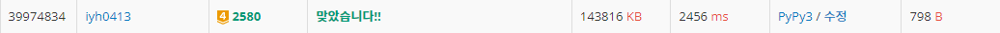

# [Baekjoon] 2580. 스도쿠 [G4]

## 📚 문제

https://www.acmicpc.net/problem/2580

---

백준 2239. 스도쿠 문제랑 똑같다. https://www.acmicpc.net/problem/2239

설명은 **백준 2239. 스도쿠 블로그 포스팅 📌** https://velog.io/@yunhlim/Baekjoon-2239.-%EC%8A%A4%EB%8F%84%EC%BF%A0-G4 을 참고한다. 

입력이랑 출력 형태만 다르니 바꿔서 제출한다.

## 📒 코드

```python
def check(y, x, num):
    # 행과 열 체크
    for k in range(9):
        if arr[y][k] == num or arr[k][x] == num:
            return False

    # 3x3 체크
    for i in range((y // 3) * 3, (y // 3) * 3 + 3):
        for j in range((x // 3) * 3, (x // 3) * 3 + 3):
            if arr[i][j] == num:
                return False
    return True     # 행렬, 3x3에 같은 숫자가 없으면 리턴 True


def recur(y, x):
    while arr[y][x] != 0:
        if x == 8:      # x좌표가 끝까지 가는지 확인
            if y == 8:  # (8, 8)에 도착하면 출력한다.
                for i in range(9):
                    print(*arr[i])
                exit()  # 출력하고 종료
            x = 0       # x좌표를 0으로 가고 y좌표를 한 칸 내린다.
            y += 1
        else:
            x += 1      # 아니면 x좌표를 한 칸 전진

    for i in range(1, 10):  # 1 ~ 9를 순차적으로 넣어준다.
        if check(y, x, i):  # check 함수에서 true가 나올 때만
            arr[y][x] = i
            recur(y, x)
            arr[y][x] = 0

arr = [list(map(int, input().split())) for _ in range(9)]
recur(0, 0)
```

## 🔍 결과

