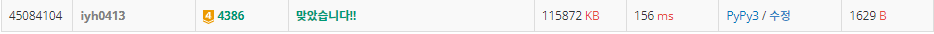

# [Baekjoon] 4386. 별자리 만들기 [G4]

## 📚 문제 : [별자리 만들기](https://www.acmicpc.net/problem/4386)

## 📖 풀이

최소 신장 트리(MST)를 구하는 문제이다.

크루스칼 알고리즘으로 해결해본다.

크루스칼 알고리즘

- 거리 순으로 담고, 거리가 작은 것부터 차례로 연결시켜준다.
- heap을 활용해서 거리가 작은 것부터 확인한다.
- 싸이클이 연결되지 않게 한다.
- 싸이클이 형성이 되는지는 Union-find 알고리즘으로 찾는다.

round()를 사용해서 소수 둘째자리까지 표기한다.

union-find를 사용할 때, 효율적으로 사용하기 위한 경로 압축과 union-by-rank를 다 사용한다.(n이 100이면 사실 사용하지 않아도 상관없다.)

간선을 n-1개 연결하면 다 연결된 것이니 종료한다.

## 📒 코드

```python
import heapq


def find(x):
    if par[x] != x:
        par[x] = find(par[x])       # 경로 압축
    return par[x]


def union(x, y):                    # union-by-rank : 합친 횟수가 적은 쪽에서 큰 쪽으로 병합
    x = find(x)
    y = find(y)
    if rnk[x] > rnk[y]:
        par[y] = x
    elif rnk[x] < rnk[y]:
        par[x] = y
    else:
        par[y] = x
        rnk[x] += 1


def distance(n1, n2):       # 거리를 구한다.(round로 소수 둘째자리 까지)
    return round(((n1[0] - n2[0]) ** 2 + (n1[1] - n2[1]) ** 2) ** (1/2), 2)


n = int(input())
arr = [0 for _ in range(n)]     # 별들의 좌표를 담은 리스트
dist = []                       # 거리와 각 별들을 담은 최소힙
par = [i for i in range(n)]     # 집합의 root
rnk = [0 for _ in range(n)]     # 집합의 rank

for i in range(n):      # 각 별들의 좌표를 담는다.
    arr[i] = list(map(float, input().split()))

for i in range(n):      # 각 별 사이의 거리 순으로 최소힙에 담아준다.
    for j in range(i + 1, n):
        heapq.heappush(dist, [distance(arr[i], arr[j]), i, j])

result = 0      # 거리의 수를 더할 result
cnt = 0         # 연결된 간선의 수를 count
while dist:
    d, x, y = heapq.heappop(dist)
    if find(x) == find(y):      # 이미 병합된 상황, cycle을 이룬 상황
        continue
    union(x, y)
    cnt += 1            # 연결된 간선의 수
    result += d         # 거리를 result에 더한다.
    if cnt == n - 1:    # 간선이 n-1개 연결되면 다 연결되었으니 종료
        break

print(result)   # 연결된 거리의 합
```

## 🔍 결과

