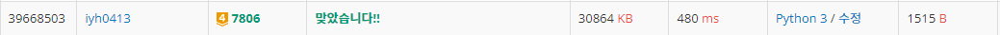

# [Baekjoon] 7806. GCD! [G4]

## 📚 문제

https://www.acmicpc.net/problem/7806

---

~~n과 k가 10억이니 직접 유클리드 호제법으로 찾는건 **시간초과**가 발생한다.~~

따라서 k를 소인수분해하여 n!에 k와 동일한 소인수가 몇 번 나오는지 찾는다.

소인수분해를 하는 방법으로는 **제곱근보다 작거나 같은 소수**를 찾고, 소수의 개수를 찾는 방법을 반복하며 찾아준다. 소수와 소수의 개수를 함께 담기 위해 **딕셔너리**를 활용한다.

**소인수분해 시 제곱근보다 큰 소인수가 하나 존재할 가능성**이 있다. 그 가능성을 항상 체크해주는 것이 포인트이다.

만약 k를 소인수 분해 했을 때 `2^3 * 3^2`가 나왔다면, n!에 2가 몇 개인지 3이 몇 개인지 파악해 최대 공약수를 구한다.

n!에 x의 개수가 존재한지 파악하는 방법은 n!//x를 n!//x가 0이 될 때까지 반복하며 그 결과값을 더하면 된다.

작은 케이스를 위에서 생각한 방식으로 풀어보자!

>4!과 30이 주어진다.
>
>우선 30을 소인수분해한다. 그럼 `2 * 3 * 5`이다.
>
>4!에 2가 몇개있는지 확인하기위해 4!//2를 계속 반복한다.
>
>4!//2 = 12, 12//2 = 6, 6//2 = 3, 3//2 = 1 => 다 더한 22가 총 2의 개수이다.
>
>22개와 1개 중 최솟값인 1개가 최대공약수에 곱해진 2의 개수이다.
>
>위처럼 3과 5도 반복해서 최대공약수에 곱해진 개수를 찾아준다.

입력의 개수가 정해져 있지 않으므로 `try:  except: break`를 활용해 종료시켜준다.

## 📒 코드

```python
while True:
    try:
        n, k = map(int, input().split())    # 입력제한이 없는 경우 try except로 해결
    except:
        break
    temp = k                    # k를 소인수분해 계산하기 위해 temp에 담는다. 
    smalls = {}                 # 소인수와 소인수의 개수를 담기 위해 딕셔너리 사용
    for i in range(2, k+1):     # k의 소인수 분해
        if i * i > k:           # 제곱근보다 클 경우 종료
            break
        while temp % i == 0:    # 소인수일 경우 개수만큼 담아준다.
            temp //= i
            if smalls.get(i):
                smalls[i] += 1    # k의 소인수와 갯수를 담기 위해 list로 담는다.
            else:
                smalls[i] = 1
    if temp != 1:               # 제곱근보다 큰 소인수 추가
        smalls[temp] = 1         # k의 소인수가 아직 덜 나왔을 때 추가

    result = 1
    for num, cnt in smalls.items():
        temp = n
        cnt2 = 0                # 소인수가 n!에 곱해진 개수
        while temp // num:
            temp //= num
            cnt2 += temp
            if cnt2 >= cnt:     # n!에 존재하는 소인수의 개수가 k의 개수보다 크거나 같으면 종료한다.
                break           # 더 파악할 필요가 없다.

        result *= num ** min(cnt, cnt2) # n!에 존재하는 소인수의 개수와, k의 소인수 개수 중 최소값을 소인수에 거듭제곱해 곱해준다.
    print(result)
```

## 🔍 결과

