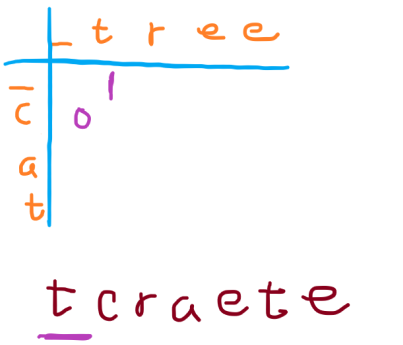
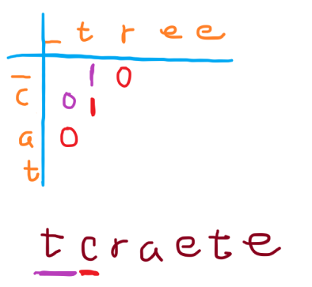
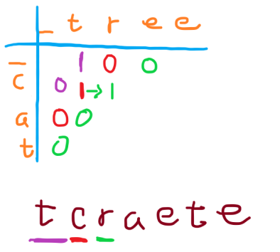
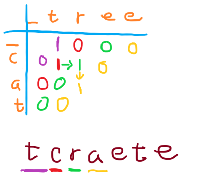
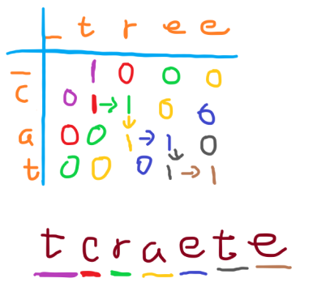
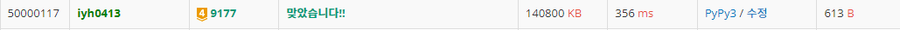

# [Baekjoon] 9177. 단어 섞기 [G2]

## 📚 문제 : [단어 섞기](https://www.acmicpc.net/problem/9177)

## 📖 탑다운 DP 풀이

처음에 딕셔너리 DP로 풀다가 그냥 리스트를 활용한 DP가 더 빠를 거 같아 바꿔서 풀었다.

왼쪽 글자의 인덱스와 오른쪽 글자의 인덱스를 활용하여 DP를 푼다.

먼저 만들어야 할 단어의 첫글자부터 확인한다.

예제 1번의 첫 번째 문제로 확인한다.

```
- input
cat tree tcraete
```

1. t

   

   첫 글자는 t이므로 c가 나오는 경우는 0으로 dp를 등록하고 t가 나오는 경우는 1로 등록한다.

2. c

   

   두 번째 글자는 c이다. 따라서 빨간 글씨처럼 dp를 등록한다. 이 때 중요한 건 위나 왼쪽에 1이 있어야 한다. 그래야 다음 글자를 이어갈 수 있다.

3. r

   

   위에서 설명했던 방식을 화살표로 나타내 보았다. r은 왼쪽에 1이 있으니 붙여서 이어갈 수 있다.

4. a

   

   a도 위에 값이 있으니 이어갈 수 있다.

이처럼 계속 이어가 그래프를 채워보면 다음과 같다.



최종적으로 끝까지 완성할 수 있으니 이 예제는 True가 된다.

위 과정을 탑다운 방식으로 바꿔 간단히 구현한다.


각 예제 별로 따로 dp를 해결하니 시간 복잡도는 1000 * 200 * 200이 된다.

4천만이니 1초 안에 가능하다.

## 📒 탑다운 DP 코드

```python
def dfs(cur, idx1, idx2):
    if cur == len(result):
        return True

    if dp[idx1][idx2] != -1:
        return dp[idx1][idx2]

    ans = 0
    if idx1 < len(string1) and result[cur] == string1[idx1]:
        if dfs(cur + 1, idx1 + 1, idx2):
            ans = 1

    if idx2 < len(string2) and result[cur] == string2[idx2]:
        if dfs(cur + 1, idx1, idx2 + 1):
            ans = 1

    dp[idx1][idx2] = ans
    return ans

n = int(input())

for tc in range(1, n + 1):
    string1, string2, result = input().split()
    dp = [[-1 for _ in range(len(string2) + 1)]
          for _ in range(len(string1) + 1)]
    print(f"Data set {tc}:", 'yes' if dfs(0, 0, 0) else 'no')
```

---

## 📖 딕셔너리 탑다운 DP 풀이

딕셔너리를 활용한 DP를 처음 사용해본 문제이다.

dp에 key가 없는 경우를 체크하면서 반복했는지 확인해야 하는데, key는 있는데 값이 0인 경우도 False를 반환해 조건문을 통과하지 못하는 걸 몰라 한참 헤맸다.

나머지 로직 자체는 위와 동일하다.

- 딕셔너리 DP

## 📒 딕셔너리 DP 코드

```python
def dfs(cur, idx1, idx2):
    if cur == len(result):
        return True
    
    if dp.get(f'{idx1},{idx2}') is not None:
        return dp[f'{idx1},{idx2}']

    ans = 0
    if idx1 < len(string1) and result[cur] == string1[idx1]:
        if dfs(cur + 1, idx1 + 1, idx2):
            ans = 1

    if idx2 < len(string2) and result[cur] == string2[idx2]:
        if dfs(cur + 1, idx1, idx2 + 1):
            ans = 1

    dp[f'{idx1},{idx2}'] = ans
    return ans


n = int(input())

for tc in range(1, n + 1):
    string1, string2, result = input().split()
    dp = {}
    print(f"Data set {tc}:", 'yes' if dfs(0, 0, 0) else 'no')
```

## 🔍 결과


