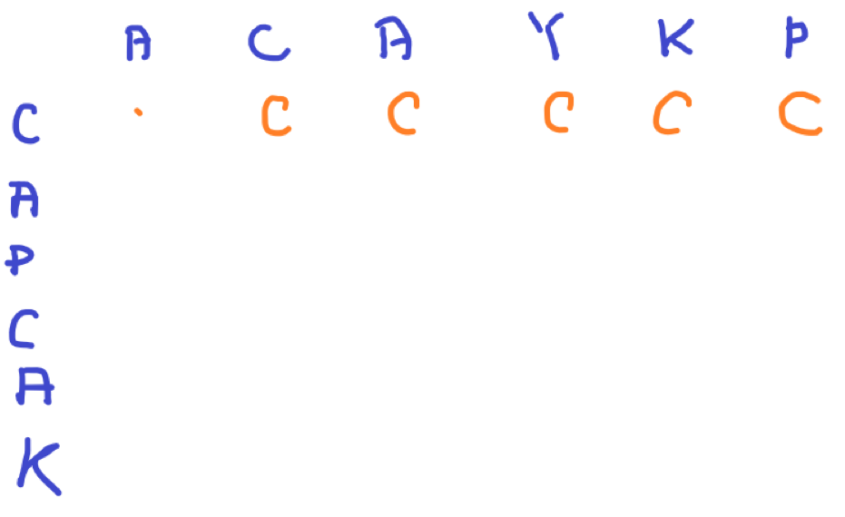

# [Baekjoon] 9252. LCS 2 [G4]

## 📚 문제

https://www.acmicpc.net/problem/9252

---

## 📖 풀이

저번에 풀었던 LCS 문제는 개수만 셌는데 이번에는 수열을 찾아 출력해야 한다.

바텀업 방식으로 풀었으니 탑다운 방식으로 풀어본다.

먼저 현재 값을 어떻게 얻어야 할까 생각해본다.

예제를 그림으로 확인해본다.

- Input

```
ACAYKP
CAPCAK
```

ACAYKP를 y축, CAPCAK를 x축으로 CAPCAK의 문자를 하나씩 꺼내며 저번 바텀업 방식으로 적어본다.



오른쪽으로 움직이며 현재 인덱스에서 가질 수 있는 최대 값을 적어준다.

---


두 문자열에서 비교하는 문자가 같지 않으면 현재 나올 수 있는 최댓값이 왼쪽값과 위쪽 값을 비교해서 넣어준다.

현재 확인하는 구간은 A하나만 올 수도 있고 C만 올 수도 있다. 이럴 땐 기존의 것으로 놔두던지 바꿔주던지 상관 없다. 나는 기존의 것으로 놔두었다.

---


A와 A가 같으면 이전에 나왔던 값인 왼쪽 위 값에 현재 값을 더한 값과 오른쪽 값을 비교한다. CA가 C보다 글자의 길이가 기니 CA로 바꿔준다.

---


값이 다르니 왼쪽 값인 CA랑 위쪽 값을 비교해 길이가 큰 값을 넣어준다.

이 과정을 반복한다.

---


그럼 다음과 같이 구해져 길이와 값을 출력하면 된다.

---

탑다운 방식으로 어떻게 적을 지 생각해보면 2가지로 나누어 생각할 수 있다.

문자열이 s1, s2라고 하면,

1. s1의 문자와 s2의 문자가 같은 경우

   이전에 나왔던 값에 더해줘야 하니 왼쪽 위 대각선 값에 문자를 더한 길이와 위쪽 값의 길이를 비교해 큰 값을 넣어준다.

   `dp[x][y] = max(dp[x-1][y-1] + s1[x], dp[x-1][y]`

2. s1의 문자와 s2의 문자가 다른 경우

   위쪽과 왼쪽을 비교해 큰 값을 넣어준다.

   ``dp[x][y] = max(dp[x][y-1], dp[x-1][y]``

위 두 가지를 고려해 분기를 나눠 코드를 작성한다.

길이가 0인 경우는 문자열을 출력하지 않는다.

## 📒 코드

```python
import sys
sys.setrecursionlimit(5000)

def recur(x, y):
    if x < 0 or y < 0:  # 문자열의 범위를 넘어서면 공백 리턴
        return ''
    if dp[x][y] != -1:  # dp에 있는지 확인
        return dp[x][y]

    result = ''
    up = recur(x - 1, y)
    if s1[x] == s2[y]:      # 왼쪽 위 값에 문자를 더해준다.
        left = recur(x - 1, y - 1) + s1[x]
    else:                   # 왼쪽 값
        left = recur(x, y - 1)
    if len(left) < len(up): # 길이가 큰 값으로 넣는다.(같을 땐 어떻게 처리해도 상관 없다.)
        result = up
    else:
        result = left
    dp[x][y] = result   # dp에 값을 넣어준다.
    return result


s1 = input()
s2 = input()
dp = [[-1 for _ in range(len(s2))] for _ in range(len(s1))] # s1의 문자열을 하나씩 골라 s2를 확인
ans = recur(len(s1) - 1, len(s2) - 1)
print(len(ans))
if len(ans):        # 길이가 0이면 출력하지 않는다.
    print(ans)
```

## 🔍 결과

