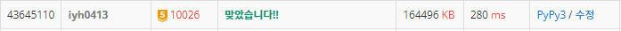

# [Baekjoon] 10056. 적록색약 [G5]

## 📚 문제 : [적록색약](https://www.acmicpc.net/problem/10026)

## 📖 풀이

두 가지로 나누어서 생각한다.

1. 적록색약이 아닌 사람
   - 빨간 초록 파랑으로 인접리스트 구하기
2. 적록색약인 사람
   - (빨간, 초록은 같은 그룹), 파랑으로 인접리스트 구하기

결국 인접리스트를 구하는 문제이다.

좌표 기준 네 방향으로 탐색하며 인접리스트를 구해준다.

적록색약인 경우는 입력받은 값이 파란색이면 연결된 값이 다 파란색이어야 하고, 파란색이 아니면 파란색이 아닌 값들을 연결시켜주면 된다.

두 번 시행해야하므로 visited를 초기화 해주는 것에 유의하자!

## 📒 코드

```python
import sys
sys.setrecursionlimit(10000)

def in_range(x, y):
    return 0 <= x < n and 0 <= y < n


def dfs(x, y, color):       # 적록색약이 아닌 경우 인접리스트 구하기
    visited[x][y] = 1
    for i in range(4):
        nx = x + dx[i]
        ny = y + dy[i]
        if in_range(nx, ny) and not visited[nx][ny] and color == arr[nx][ny]:
            dfs(nx, ny, color)


def dfs_rg(x, y, color):    # 적록색약인 경우 인접리스트 구하기
    visited[x][y] = 1
    for i in range(4):
        nx = x + dx[i]
        ny = y + dy[i]
        if in_range(nx, ny) and not visited[nx][ny]:
            if color == 'B' and arr[nx][ny] == 'B':
                dfs_rg(nx, ny, color)
            elif color != 'B' and arr[nx][ny] != 'B':
                dfs_rg(nx, ny, color)


n = int(input())
arr = [input() for _ in range(n)]
visited = [[0] * n for _ in range(n)]
dx = [0, 1, 0, -1]
dy = [1, 0, -1, 0]
# 적록 색약이 아닌 경우
cnt = 0
for i in range(n):
    for j in range(n):
        if visited[i][j]:
            continue
        dfs(i, j, arr[i][j])
        cnt += 1

# 적록 색약인 경우
visited = [[0] * n for _ in range(n)]
cnt_rg = 0
for i in range(n):
    for j in range(n):
        if visited[i][j]:
            continue
        dfs_rg(i, j, arr[i][j])
        cnt_rg += 1

print(cnt, cnt_rg)
```

## 🔍 결과


