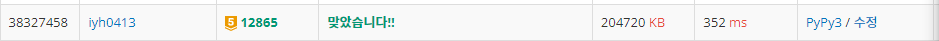

# [Baekjoon] 12865. 평범한 배낭[G5]

문제 : https://www.acmicpc.net/problem/12865

---

모든 물건을 하나씩 추가하며 확인하는 재귀함수로 풀어본다.

생각만해도 풀어야할 가짓수가 너무 많다. 예상대로 시간초과가 뜬다..

재귀로 푼 코드:

```python
N, K = input().split()    # 물품의 수(1<=N<=100), 버틸 수 있는 무게 K(1 ≤ K ≤ 100,000)
N = int(N)
lst_WV = [] # 무게와 가치를 튜플로 담는다.
for i in range(N):  # 물건의 무게 W(1 ≤ W ≤ 100,000), 물건의 가치 V(0 ≤ V ≤ 1,000)
    lst_WV.append(tuple(input().split()))
weight = 0  # 현재 무게
value = 0 # 현재 가치
value_max = 0 # 가장 큰 가치
index_lst = [0 for _ in range(N)]   # 등장한 물품은 1로 표시(중복을 제거하기 위해)


def recur(cur):
    global weight, value, value_max
    if cur == N:
        return
    for i in range(N):  
        if (not index_lst[i]) and (weight + int(lst_WV[i][0])) <= int(K): 
            weight += int(lst_WV[i][0])
            value += int(lst_WV[i][1])
            index_lst[i] = 1
            recur(cur+1)
            weight -= int(lst_WV[i][0])
            value -= int(lst_WV[i][1])
            index_lst[i] = 0

    if value_max < value:
        value_max = value


recur(0)
print(value_max)
```

---

속도를 높이기 위해 메모리 때매 string으로 썼던 거 전부 int로 변경해본다.. 그래도 시간초과 ... input readline() 써도 시간초과가 뜬다.

global 변수 제거 답은 똑같... 등장한 물품 표시하는 걸 리스트가 아닌 set로 사용해도 똑같다 ㅜㅜ

속도를 더 높여본 재귀 코드는 다음과 같다.

```python
from sys import stdin
N, K = list(map(int, stdin.readline().split()))    # 물품의 수(1<=N<=100), 버틸 수 있는 무게 K(1 ≤ K ≤ 100,000)
lst_WV = [] # 무게와 가치를 튜플로 담는다.
for i in range(N):  # 물건의 무게 W(1 ≤ W ≤ 100,000), 물건의 가치 V(0 ≤ V ≤ 1,000)
    lst_WV.append(tuple(map(int, stdin.readline().split())))
index_set = set() 


def recur(cur, weight, value, value_max):
    
    if cur == N:
        if value_max < value:
            value_max = value
        return value_max
    for i in range(N):  
        if (i not in index_set) and (weight + lst_WV[i][0]) <= K: 
            weight += lst_WV[i][0]
            value += lst_WV[i][1]
            index_set.add(i)
            value_max = recur(cur+1, weight, value, value_max)
            weight -= lst_WV[i][0]
            value -= lst_WV[i][1]
            index_set.remove(i)

    if value_max < value:
        value_max = value
    return value_max


print(recur(0, 0, 0, 0))

```

결과:


---

재귀로는 시간초과를 해결할 수 없으니 중복된 계산을 줄여주는 동적 계획법으로 풀어 본다. 물건을 하나씩 넣으며 최상의 가치를 적는다. 표로 생각을 정리해본다.

가방의 무게가 7이므로 1~7로 표를 적는다.

물건을 순서대로 파악하며 최상의 가치를 찾는다.

| 물건(무게,가치) \ 무게 | 1    | 2    | 3    | 4    | 5    | 6    | 7    |
| ---------------------- | ---- | ---- | ---- | ---- | ---- | ---- | ---- |
| 6 13                   | 0    | 0    | 0    | 0    | 0    | 13   | 13   |
| 4 8                    | 0    | 0    | 0    | 8    | 8    | 13   | 13   |
| 3 6                    | 0    | 0    | 6    | 8    | 8    | 13   | 14   |
| 5 12                   | 0    | 0    | 6    | 8    | 12   | 13   | 14   |

물건의 무게보다 가방의 무게가 작을 땐 윗 행의 값을 그대로 넣어준다.

현재 무게 대비 가치를 바꾸기 위해서는 이전 행에서 물건의 무게를 뺀 만큼의 가치 + 물건의 가치가 이전 행의 무게에서의 가치보다 크면 바꾼다. 위의 표를 보면 세번째 물건이 가방의 무게가 7일 때 13에서 14로 바꿔주었다. 이 때 이 물건이 들어왔을 때 가치가 늘어나는지 파악하기 위해 이전 행에서 가방의무게 - 물건의 무게인 무게가 4일 때의 가치가 8이었다. 8+물건의가치인 6을 더하면 14로 13보다 크니 바꾸어준다. 이를 반복한다.

동적 계획법으로 풀이한 코드:

```python
N, K = map(int,input().split())    # 물품의 수(1<=N<=100), 버틸 수 있는 무게 K(1 ≤ K ≤ 100,000)
lst_WV = [(0,0)] # 무게와 가치를 튜플로 담는다.
for i in range(N):  # 물건의 무게 W(1 ≤ W ≤ 100,000), 물건의 가치 V(0 ≤ V ≤ 1,000)
    lst_WV.append(tuple(map(int,input().split())))
# 물건을 하나씩 넣고, 0 부터 1씩 증가하며 무게 대비 현재 최고의 가치를 적는 메모이제이션
memo = [[0 for _ in range(K+1)] for _ in range(N+1)]

for i in range(1, N+1):    # 첫번째 물건부터 검색한다
    weight = lst_WV[i][0]   # 선택된 물건의 무게
    value = lst_WV[i][1]    # 선택된 물건의 가치
    for j in range(1, K+1):    # 무게를 0부터 K까지 올려가며 무게대비 최선의 경우를 대입한다.
        if weight > j:    # 현재 무게보다 물건의 무게가 작으면 전 물건에서 사용했던 값을 사용
            memo[i][j] = memo[i-1][j]
        else:
            if value + memo[i-1][j-weight] > memo[i-1][j]:  # 가치가 더 높은 걸 선택
                # 현재 무게에서 물건의 무게를 뺀 가치에다가 현재물건을 더한 가치와 이전 가치를 비교
                memo[i][j] = value + memo[i-1][j-weight]
            else: memo[i][j] = memo[i-1][j] 

print(memo[N][K])
```

결과:



배낭문제를 처음 접해보니 시간초과를 해결하기 어려웠다. 동적계획법으로 해결할 수 있는 대표적인 문제라 동적계획법부터 순차적으로 공부해가며 풀이했다. 새로운 알고리즘을 익혀나가는 재미가 있다.🧐🧐