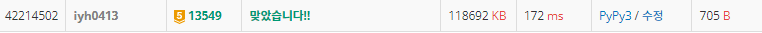

# [Baekjoon] 13549. 숨바꼭질 3 [G5]

## 📚 문제

https://www.acmicpc.net/problem/13549

---

## 📖 풀이

**BFS**로 해결한다.

현재 위치 기준 순간이동한 경우는 모두 같은 시간으로 표시한다.

큐에 수빈이의 위치와 그 때의 시간을 0으로 넣어준다.

따라서 먼저 위치마다 시간을 담을 배열을 만들어주는데 -1로 초기화 해놓는다.

확인할 값이 100000까지이니 대충 200000까지 만들어놓는다. 

순간이동을 현 위치 기준 x2니까 200000보다 커지는 값이 들어올 수 없다.

시간이 안 적혀있는 경우 큐에 담아준다.

동생의 위치에 시간을 담아주면 그 때 값을 출력하고 종료한다.

## 📒 코드

```python
from collections import deque


def check(node):    # 동생의 위치를 찾았는지 확인
    if node == k:
        print(visited[k])   # 시간을 출력하고 종료
        exit()


def telpo(node):    # 텔레포트
    nxt = node
    while nxt <= k:     # 동생의 위치를 뛰어 넘은 경우 2배를 더 곱하지 않는다.
        nxt = nxt * 2               # x2 텔레포트
        if visited[nxt] != -1:      # 방문했던 지점이면 종료(그 지점 이후는 이미 다 방문표시 되어있다.)
            break
        visited[nxt] = visited[node]    # 방문 표시
        check(nxt)                      # 동생이 있는지 확인
        que.append(nxt)                 # 큐에 넣는다.


n, k = map(int, input().split())
visited = [-1 for _ in range(200000)]   # 방문할 때의 시간을 적는다.
que = deque()
visited[n] = 0                          # 시작점인 수빈이의 위치에 시간은 0을 넣는다.
check(n)                                # 시작점에 같이 있는지 확인
que.append(n)                           # 큐에 넣어준다.
telpo(n)                                # 텔레포트

while que:                              # 큐에 값이 없을 때까지 반복
    v = que.popleft()                   # 큐에서 하나씩 꺼낸다

    for i in [-1, 1]:                   # 양쪽으로 이동
        nxt = v + i
        if 0 <= nxt and visited[nxt] == -1:     # 범위를 넘지 않을 때, 방문하지 않은 경우
            visited[nxt] = visited[v] + 1
            check(nxt)
            que.append(nxt)
            telpo(nxt)
```

## 🔍 결과

