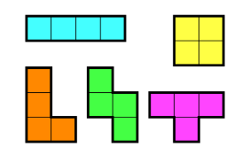
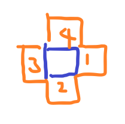
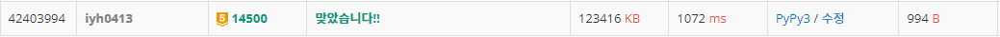

# [Baekjoon] 14500. 테트로미노 [G5]

## 📚 문제

https://www.acmicpc.net/problem/14500

---

## 📖 풀이



가장 합이 최대가 되는 테트로미노 모양을 찾는 것이다.

보라색 모형 빼고 나머지는 스택을 활용하여 구할 수 있다. 무조건 연결되는 부분으로 붙어야 한다.

따라서 나머지 4가지 도형은 DFS로 탐색하여 구하고, 보라색은 따로 구해준다.


### 보라색을 제외한 4가지 도형 탐색 방법

현재 점 기준 DFS로 4칸 움직이는 모든 경우를 구하고, 최댓값을 구한다.

BFS를 사용할 수 없는 이유는 스택을 활용해서 하나씩 붙여줘야하기 때문에 DFS를 사용한다.

DFS를 사용할 때 중요한 포인트는, 현재 좌표는 방문표시를 해 확인한 칸은 다시 확인하지 않도록 한다. 그리고 확인했으면 다시 방문표시를 지워야 한다.

**탑다운** 방식을 사용해서 해결한다. 네 방향으로 탐색하면서 네 방향 중 가장 큰 값을 리턴하는 방식으로 접근한다. 그러면 길이가 4인 합이 가장 큰 값을 리턴하게 된다. 방문표시를 앞 뒤로 해줘야하니 신경써야 한다!


### 보라색 탐색 방법



현재 좌표 기준 네 방향을 탐색한다.

네 방향의 값을 리스트에 담아 3개 이상인 경우만 합을 리턴한다. 아닌 경우는 0을 리턴해 최댓값 비교할 때 갱신할 수 없게 만든다.

네 개의 값이면 정렬시켜 크기가 큰 3개의 값의 합을 리턴한다. 거기다가 가운데 값인 현재 좌표 값을 더해서 비교한다.


## 📒 코드

```python
def in_range(x, y):         # 범위를 만족시키는지 확인할 함수
    return 0 <= x < n and 0 <= y < m


def dfs(cur, x, y, total):  # 연결된 4개의 테트로미노 구하기
    if cur == 3:            # 4개 연결된 경우
        return total

    visited[x][y] = 1       # 연결한 좌표를 다시 탐색하지 않도록 방문표시

    ret = 0                 # 탑다운 방식으로 해결하기 위해 리턴값을 정의한다.
    for i in range(4):      # 네 방향 탐색
        nx = x + dx[i]
        ny = y + dy[i]
        if in_range(nx, ny) and not visited[nx][ny]:
            ret = max(ret, dfs(cur + 1, nx, ny, total + arr[nx][ny]))   # 네 방향 중 최대값을 리턴한다.

    visited[x][y] = 0       # 마지막에 방문표시를 다시 지워줘야 한다.
    return ret


def purple(x, y):   # 보라색 테트로미노를 확인할 함수('ㅗ' 모양)
    nums = []       # 현재 좌표 기준 네 방향으로 존재하는 값들을 다 담아줄 리스트

    for i in range(4):
        nx = x + dx[i]
        ny = y + dy[i]
        if in_range(nx, ny):    # 범위를 만족한 경우 담아준다.
            nums.append(arr[nx][ny])
    
    if len(nums) >= 3:          # 길이가 3 이상인 경우만 합해서 리턴
        nums.sort(reverse=True)     # 크기가 큰 3개를 더해서 리턴
        return sum(nums[0:3])
    else:       # 길이가 3보다 작으면 0을 리턴해서 최댓값 비교해도 바뀌지 않도록 한다.
        return 0


n, m = map(int, input().split())
arr = [list(map(int, input().split())) for _ in range(n)]
visited = [[0] * m for _ in range(n)]
dx = [0, 1, 0, -1]
dy = [1, 0, -1, 0]

result = 0
for i in range(n):
    for j in range(m):
        result = max(result, dfs(0, i, j, arr[i][j]), purple(i, j) + arr[i][j])

print(result)
```

## 🔍 결과


