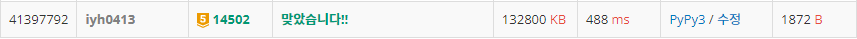

# [Baekjoon] 14502. 연구소 [G5]

## 📚 문제

https://www.acmicpc.net/problem/14502

---

## 📖 풀이

가로 세로가 8 x 8 이므로, 벽을 3개 세우는 최대 경우의 수는 조합으로 `64 * 63 * 62 / 3 * 2 * 1` 이다.

따라서 재귀함수로 벽을 세 개를 세우는 모든 경우를 조합으로 찾아준다. 그리고 벽을 세워준다.

벽을 세 개 세운 순간, 각각 BFS로 바이러스를 확산 시킨 후, 안전 영역의 개수를 센다.

## 📒 코드

```python
from collections import deque


def in_range(x, y):     # 범위에 속하는지 확인
    return 0 <= x < n and 0 <= y < m


def recur(cur, x, y):   # 벽을 3개 세워준다.(조합)
    global max_safety
    if cur == 3:        # 벽을 3개 다 세운 경우
        max_safety = max(bfs(), max_safety)     # bfs 탐색을 한 후 최댓값 갱신
        return
    if y == m:          # y가 영역을 넘어가면 다음 행으로
        y = 0
        x += 1
    if x == n:          # x가 영역을 넘어가면 종료
        return

    recur(cur, x, y + 1)        # 벽을 안 세운다.
    if arr[x][y] == 0:
        arr[x][y] = 1
        recur(cur + 1, x, y + 1)    # 벽을 세운다.
        arr[x][y] = 0


def bfs():          # bfs로 안전영역 탐색
    visited = [[0] * m for _ in range(n)]
    que = deque()
    cnt = 0     # 바이러스와 벽을 센다.(여집합으로 안전영역을 세기 위함)
    for i in range(n):
        for j in range(m):
            if arr[i][j] == 2:      # 바이러스를 큐에 담는다.
                que.append((i, j))
                visited[i][j] = 1
                cnt += 1
            elif arr[i][j] == 1:    # 벽도 방문 불가
                visited[i][j] = 1
                cnt += 1

    while que:          # 바이러스 확산
        x, y = que.popleft()
        for nxt in range(4):
            nx = x + dx[nxt]
            ny = y + dy[nxt]
            # 배열의 영역을 넘어가거나, 안전영역이 아닌 경우 continue
            if not in_range(nx, ny) or visited[nx][ny]:
                continue
            cnt += 1
            visited[nx][ny] = 1
            que.append((nx, ny))

    return n * m - cnt      # 안전영역의 크기

dx = [0, 1, 0, -1]
dy = [1, 0, -1, 0]
n, m = map(int, input().split())
arr = [list(map(int, input().split())) for _ in range(n)]
max_safety = 0
recur(0, 0, 0)
print(max_safety)
```

## 🔍 결과

