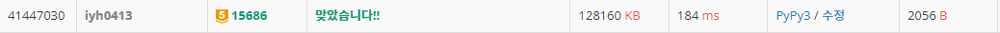

# [Baekjoon] 15686. 치킨 배달 [G5]

## 📚 문제

https://www.acmicpc.net/problem/15686

---

## 📖 풀이

치킨집과 집을 다 배열에 담는다.

치킨집을 하나씩 꺼내며 각 집까지의 거리를 구한다.

그리고 조합으로 치킨집을 m개만큼 골라, 그 때 집에서의 거리를 보며 가장 작은 값을 찾아 더해준다.

집에서 거리를 구할 때 고르지 않는 치킨집은 제외한 후 최솟값을 구해야 한다.

## 📒 코드

```python
def recur(cur, cnt):    # 치킨집을 m개 고르기 위한 조합
    global city_min_d
    if cnt == m:
        city_d = 0              # 도시의 치킨 거리
        for i in range(h):
            min_d = 1000        # 현재 집에서 치킨집까지의 최소 거리
            for j in range(c):
                if visited[j] == 0:     # 뽑힌 치킨집만
                    continue
                min_d = min(min_d, dist[i][j])      # 최소 거리로 업데이트
            city_d += min_d                     # 모든 집에서의 거리의 합
            if city_d >= city_min_d:         # 구하고 있는 도시의 치킨 거리 값이 현재 도시의 치킨 거리의 최소값보다 크거나 같으면 종료
                return
        city_min_d = min(city_d, city_min_d)    # 도시의 치킨 거리의 최솟값
        return
    if cur == c:            # 조합을 완성하지 못하고 범위를 넘어가면 종료
        return
    
    recur(cur + 1, cnt)     # 현재 치킨집을 고르지 않는다.
    visited[cur] = 1
    recur(cur + 1, cnt + 1)     # 현재 치킨집을 고른다.
    visited[cur] = 0


n, m = map(int, input().split())
arr = [list(map(int, input().split())) for _ in range(n)]
city_min_d = 1000000
chickens = []
c = 0   # 치킨집 개수
houses = []
h = 0   # 집 개수
for i in range(n):
    for j in range(n):
        if arr[i][j] == 2:
            chickens.append([i, j])     # 치킨집의 좌표를 리스트에 담는다.
            c += 1
        elif arr[i][j] == 1:
            houses.append([i, j])       # 집의 좌표를 리스트에 담는다.
            h += 1

dist = [[0] * c for _ in range(h)]      # 각 치킨집에서 집까지의 거리를 구한다.
for i in range(h):
    h_x, h_y = houses[i]
    for j in range(c):
        c_x, c_y = chickens[j]
        dist[i][j] = abs(h_x - c_x) + abs(h_y - c_y)    # 거리를 2차원 배열에 담는다.

visited = [0 for _ in range(c)]
recur(0, 0)         # 치킨집을 m개 고르기 위한 조합
print(city_min_d)
```

## 🔍 결과

