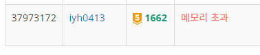

# [Baekjoon] 1622. 압축[G5]

## 📚 문제

https://www.acmicpc.net/problem/1662

---

처음에 간단히 생각 했던 방법은 K(Q)를 숫자로 바꾸어 재귀함수를 활용해 값을 쭉 풀어주는 방법이었다.

가장 안쪽의 ()를 찾기 위해 `enumerate()`함수를 사용한다. (를 만날 때마다 index를 그 때의 값으로 바꿔주고 )를 만나면 그때의 index도 함께 저장하며 반환하여 가장 안쪽의 (, ) index를 저장한다.

index를 저장했으면 K(Q)를 활용해서 Q~Q의 길이를 K개로 바꾸어 문자열로 넣어주었다.

## 📒 1차 코드

```python
def un_zip(string):
    start_i = 0
    last_i = 0
    for i, v in enumerate(string):
        if v == '(':
            start_i = i
        elif v == ')':
            last_i = i
            break
    if start_i == 0:
        return len(string)
    un_zip_str = int(string[start_i-1])*string[start_i+1:last_i]
    new_str = string[:start_i-1] + un_zip_str + string[last_i+1:]
    return un_zip(new_str)

print(un_zip(input()))
```

그런데 이렇게 하면 문제점이 문자열의 길이가 너무 길어져 **메모리 초과**가 발생한다.

## 🔍 1차 결과



---

해결하기 위해 4시간 동안 코딩.. 처음에는 `input()` 대신 `sys.stdin.readline()`을 사용하면 시간 초과나 메모리 초과를 해결할 수도 있다하여 사용했지만 똑같이 메모리 초과가 발생..😢

결국 알집을 풀어서 원본을 만들어 마지막에 개수를 찾는 것이 아니라, (Q) 안의 문자열 갯수를 세서 K를 곱한 다음 <K*Q의길이>로 문자열에 넣어주면서 반복한다.

()안에 <>가 있으면 그 때의 숫자 값 자체가 길이니까 <>아닌 숫자들의 갯수에 그 값을 더해서 계속 반복해준다.

다음이 그 알고리즘을 적용한 코드이다.

## 📒 최종 코드

```python
import sys

def un_zip(string):
    start_i = 0
    last_i = 0
    un_zip_str_len = 0
    cnt = 0
    open_i = 0
    close_i = 0
    for i, v in enumerate(string):  # ()를 찾아준다.
        if v == '(':    # index 순서대로 찾으며 (가 새로 들어올 때마다 저장
            start_i = i
        elif v == ')':  # )를 만나면 그 때를 last_i에 담고 break
            last_i = i
            break
    if start_i == 0:    # ()가 없을 때 조건문을 읽는다. 마지막 답 구할 때 사용
        if '<' in string:      # <, >를 찾아 안에 값은 숫자로 더해준다.
            for i,v in enumerate(string):
                if v == '<':
                    open_i = i
                    un_zip_str_len += cnt
                    cnt = 0
                elif v == '>':
                    close_i = i
                    un_zip_str_len += int(string[open_i+1:close_i])
                    cnt = 0
                else : cnt += 1 # < > 이외에 있는 값들은 갯수로 센다.
            un_zip_str_len += cnt
        else: 
            un_zip_str_len = len(string)
        return un_zip_str_len
    
    if '<' in string[start_i+1:last_i]: # ()가 있을 땐 여기로 들어온다.
        un_zip_str = string[start_i+1:last_i]
        for i, v in enumerate(un_zip_str):
            if v == '<':
                open_i = i
                un_zip_str_len += cnt
                cnt = 0
            elif v == '>':
                close_i = i
                un_zip_str_len += int(un_zip_str[open_i+1:close_i])
                cnt = 0
            else : cnt += 1
        un_zip_str_len += cnt
        un_zip_str_len *= int(string[start_i-1])
    else : un_zip_str_len = int(string[start_i-1])*(last_i - start_i-1)
    
    new_str = string[:start_i-1] + '<'+ str(un_zip_str_len) + '>' + string[last_i+1:]
    return un_zip(new_str)

print(un_zip(sys.stdin.readline().strip()))
```

## 🔍 최종 결과


이렇게 하니 메모리 초과를 해결하였다.

6시간 정도 끙끙대며 풀어봤는데 **코드길이가 속도랑 비례하지는 않다**는 걸 절실히 깨달았다.

50줄 정도 나왔는데 더 깔끔히 코드를 만들 수 있게 **알고리즘 공부 + 풀이량**을 늘려야겠다!!

**주석처리**하는 습관과 코드가 길어지면 중간중간 **git에 정보를 올리며 수정**하는 습관도 다져야겠다.